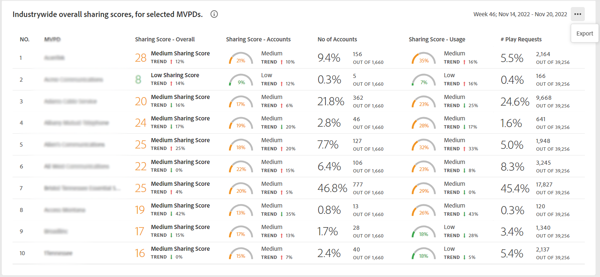
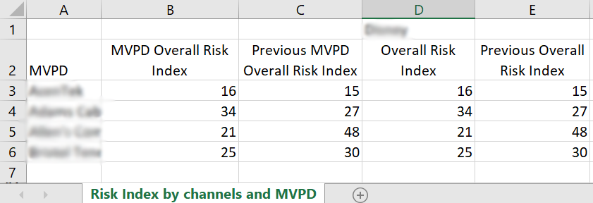

# 导出区段中程序员和选定MVPD的量度 {#export-metric}

帐户IQ中的功能板显示用于共享选定区段中订阅者帐户的凭据共享统计信息的表格和图形。 除了查看共享模式和分数之外，您还可以从这些表中导出帐户使用量度，并共享选定区段中MVPD和渠道的订阅者的分数。

要导出特定程序员的量度和区段中选择的MVPD，请在您以授权程序员用户身份登录后：

1. 按照 [如何定义区段和选择时间范围](/help/AccountIQ/howto-select-segment-timeframe.md) 从 [区段和时间范围](/help/AccountIQ/segments-timeframe.md) 的上界。

1. 转到以下面板之一：

   * 业界范围内的特定MVPD总共享分数
      

   * 按渠道和MVPD共享分数

      

   * 通过共享概率级别确定的帐户数量和使用情况

      

1. 选择 **导出** 选项。

数据将以CSV格式导出，并且文件将在您的设备上本地下载。 您可以使用所需的CSV查看器和编辑器打开导出的报表。

* 所选MVPD的行业级别共享分数

   

* 在区段中按渠道和MVPD共享分数

   

* 通过共享概率级别确定的帐户数量和使用情况

   
