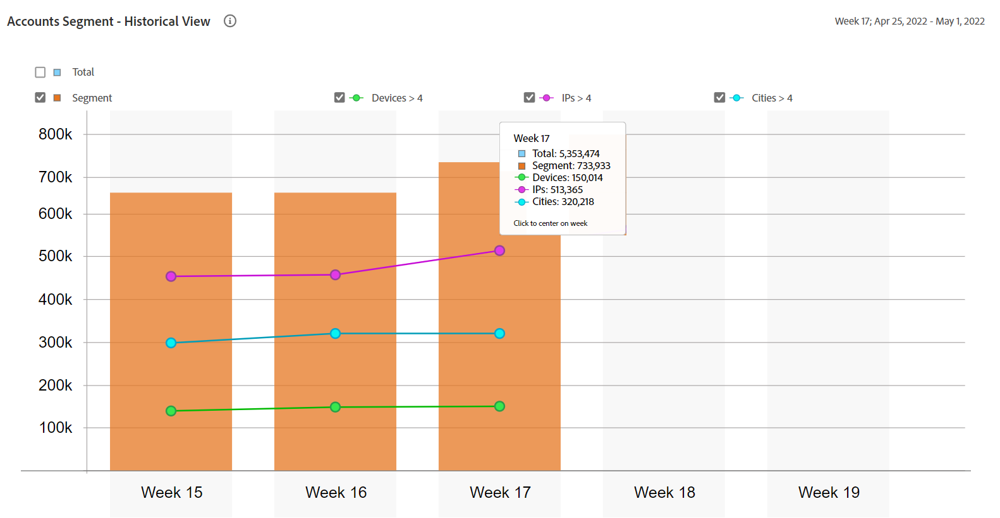

# “常规使用情况”报表 {#general-usage-reports}

帐户IQ报表是基本的分析工具和报表，可让您深入查看数据以将其隔离 [同类组](/help/AccountIQ/product-concepts.md#segmet-def)，识别异常，并了解您的帐户特征。

“常规使用情况报表”页面提供了一些工具，用于根据正在使用的帐户设备数量、检测到的IP以及相应的邮政编码来划分子组量度。

<!--Divide the content in cohorts.

Content filters
device filters

segment and definition replicate to cohorts. Number of people and number of account that ......
content consumption.....-->

所有报告均基于使用以下方式选择的当前区段 [区段和时间范围](/help/AccountIQ/howto-select-segment-timeframe.md) 面板。 您可以通过指定以下阈值来优化选择并进一步缩小选择范围（设备数、IP数和邮政编码数）： [快照概述 — 帐户超过阈值](#snapshot-overview) 面板。

<!--To view General Usage Reports:

1. Select the desired MVPDs from the **MVPDs in Segment** option.

2. Select the desired programmer channels from the **Channels in Segment** Option.

3. Select an appropriate time frame from the **Granularity and time frame** option.

   Using the above options you have defined segments for your analysis. Based on your segment selection, following graphs and reports are displayed.

4. You can fine tune your selection and further narrow it down by specifying (number of devices, number of IPs, and number of zip codes) thresholds in [Snapshot Overview - Accounts above thresholds](#snapshot-overview) widget/panel.-->

## AuthN正常/AuthZ正常/播放请求/独特订阅者 {#authn-authz-playreq-uniquesubs}

此处的线形图为您提供了在定义区段的选定时间范围内，AuthN OK、AuthZ OK、Play Requests和Unique Subscribers的值随时间变化的视图。

+++程序员 —  **AuthN正常/AuthZ正常/播放请求/独特订阅者**

*图：程序员用户的AuthN正常/AuthZ正常/播放请求/独特订阅者*

+++

+++MVPD- **AuthN正常/AuthZ正常/独特订阅者**

*图：MVPD用户的AuthN正常/AuthZ正常/唯一订阅者*

+++

x轴表示当前时间范围内的单位，y轴表示该期间的基本订户活动量度。 通过折线图可以比较在区段选择面板中选择的MVPD和渠道订阅者的以下值：

* **身份验证正常**

   AuthN OK是成功的身份验证次数。 有关更多信息和定义，请参阅 [产品概念：验证确定](/help/AccountIQ/product-concepts.md#authn-ok-def).

* **AuthZ正常**

   AuthZ OK是成功的授权数。 有关更多信息和定义，请参阅 [产品概念：AuthZ正常](/help/AccountIQ/product-concepts.md#authz-ok-def).

* **播放请求**

   Play requests是播放请求数。 有关更多信息和定义，请参阅 [产品概念：播放请求](/help/AccountIQ/product-concepts.md#play-requests-def)

   >[!NOTE]
   >
   >播放请求折线图不适用于MVPD用户。

* **独特订阅者**

   Unique subscribers是成功的独特订阅者的数量。 有关更多信息和定义，请参阅 [产品概念：独特订阅者](/help/AccountIQ/product-concepts.md#unique-subscriber-def)

   >[!NOTE]
   >
   >如果程序员使用AdobeTempPass（免费预览）是区段的一部分，则独特订阅者的总数还包括独特设备的数量。

## 快照概述 — 帐户超过阈值 {#snapshot-overview}

使用此附加过滤器优化分析和报告，以设置各种使用阈值。 通过选择所需的MVPD和渠道来定义要分析的区段（或同类群组）后，您还可以使用以下过滤器来分析订阅者行为：

* 设备数量阈值

* IP数量阈值

* 邮编数量阈值

当您在中更新阈值时 [帐户段 — 基于选定的阈值](#account-segments-basedon-segments) 面板中，您可在以下位置查看影响：

* [每个帐户每周（或每月）的设备数](#devices-week-account)

* [每个帐户的每周（或每月）位置数](#locations-week-account)

* [每个帐户每周（或每月）的IP数](#ip-week-account)

* [帐户段的历史视图](#account-segment-historical-view)

>[!NOTE]
>
>每个阈值的默认值为4。 这意味着，“一般用法”页面显示对订阅者的MVPD的分析，这些订阅者使用四个（和四个以上）设备，使用来自四个（和更多）不同地理位置和四个（和更多）不同邮政编码的内容。

### 帐户段 — 基于选定的阈值 {#account-segments-basedon-segments}

此 **帐户段 — 基于选定的阈值** 面板为您提供了设置设备数量、IP数量和邮政编码数量的阈值（介于1和10之间）的选项。

该图显示了：

* 订阅者帐户的绝对数量，以及

* 占该区段总订户账户的百分比，

   “ ”使用X个设备、 Y个IP和Z个邮政编码以在一个时间范围内使用（定义的区段）MVPD的渠道中的内容。

## 每个帐户的每周（或每月）设备数 {#devices-week-account}

此 **条形图** 提供有关订阅者如何使用其设备访问内容的使用行为的洞察。

x轴绘制帐户数，y轴绘制设备数。 根据您为每个帐户设置的设备数阈值，它会标记在一周内使用特定数量设备内容的订户帐户的绝对数量。

当鼠标悬停在条形（特定于设备数）上时，会出现一个标签，提供有关一周内使用这些许多设备流式传输渠道内容的订户帐户数（以及区段中的订户帐户总数占总订户帐户的百分比）的信息。

该图还标记了以下内容：

* 一条红线，用于标记您设置的阈值。

* 一条绿线，用于标记订阅者帐户每周（或每月）使用的不同设备的平均数量。

您可以将阈值级别与帐户使用的不同设备的每周平均数量进行比较，以判断共享级别。

该图还大致显示了使用设备数超过设定阈值的订户帐户的百分比。

圆环图可帮助您快速判断使用超过设置阈值的设备（在时间范围内）占用渠道内容的订户帐户的大小。

## 每个帐户的每周（或每月）位置数 {#locations-week-account}

点赞 [每个帐户的每周（或每月）设备数](#devices-week-account)，每周（或每月）的位置量度可帮助您分析不同位置的订户帐户使用情况，以便更密切地识别密码共享。 x轴绘制帐户数，y轴绘制位置数。

此量度与数量合并的结果 [每个帐户的每周（或每月）设备数](#devices-week-account) 和数量 [每个帐户每周（或每月）的IP数](#ip-week-account) 帮助您更准确地判断密码共享实例；这样真实的用户就不会被计入。

定义区段并设置位置数量的阈值后，即可从图形中识别：

* 一周内从（特定）x个位置消费内容的订阅者的数量（和百分比）。

* 从超出阈值的更多位置查看内容的总订户帐户数的百分比。

* 将每周平均值（帐户的不同位置数量）与阈值进行比较。

## 每个帐户每周（或每月）的IP数 {#ip-week-account}

类似于 [每个帐户的每周（或每月）设备数](#devices-week-account) 和 [每个帐户的每周（或每月）位置数](#locations-week-account)，则 **每个帐户每周IP数** 量度允许您更精确、更精细地分析密码共享。

x轴绘制帐户数，y轴绘制IP数。

定义区段（通过选择MVPD和通道）并设置IP数量的阈值后，您可以从图形中识别：

* 一周内从（特定） x个IP地址使用内容的订阅者数量（和百分比）。

* 从超过阈值的IP地址查看内容的总订户帐户的百分比。

* 将每周平均值（帐户的不同IP数量）与阈值进行比较。

## 帐户段 — 历史视图 {#account-segment-historical-view}

“历史视图”条形图可帮助您比较不同时间范围内的使用情况量度。 此外，它还集体绘制各种使用量度，例如 [每个帐户的每周（或每月）设备数](#devices-week-account)， [每个帐户的每周（或每月）位置数](#locations-week-account)、和 [每个帐户每周（或每月）的IP数](#ip-week-account).

* x轴绘制时间范围，y轴绘制订户帐户、设备、位置和IP的数量。

* 橙色条表示不同时间范围内的区段。

* 线形图绘制以下更改 [每个帐户的每周（或每月）设备数](#devices-week-account)， [每个帐户的每周（或每月）位置数](#locations-week-account)、和 [每个帐户每周（或每月）的IP数](#ip-week-account) 时间范围内的值基于阈值。

* 蓝色条表示在某个时间范围内整个行业的活跃订阅者总数。

* 您可以选择特定的图例，它们可帮助您缩放图形。

>[!MORELIKETHIS]
>
>* 了解如何使用导出选定区段中排名前1000的订阅者的报表，并使用常规使用情况报表中的过滤器 [导出前1000个帐户](/help/AccountIQ/export-acc-information.md) 选项。

