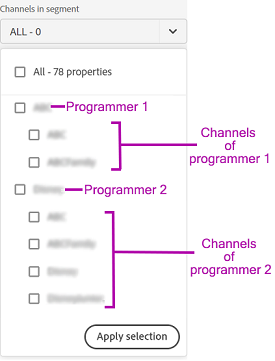

# 定义区段和时间范围 {#define-segment}

帐户IQ中的所有分析或查看报表均从定义区段和选择评估的时间范围开始。 [区段](/help/AccountIQ/product-concepts.md#segmet-def) 指符合您评估标准（订阅MVPD和查看特定渠道）的所有订阅者或查看者。

*图：区段和时间范围选择*

在帐户IQ中所有报表页面的顶部，有一个面板可通过选择MVPD、渠道程序员以及粒度和时间范围来定义区段。

## 区段选择 {#select-segment}

### 选择区段中的MVPD {#select-segment-mvpds}

要从中选择MVPD **区段中的MVPD** 选项：

1. 单击或点按 **区段中的MVPD** 下拉菜单选项。

   >[!NOTE]
   >
   >**全部** 默认情况下会选择行业MVPD。 在此处，您可以选择以下任一选项 **前10个MVPD（按共享得分）**， **按使用量列出的10大MVPD**， **按帐户划分的前10个MVPD**&#x200B;或单个MVPD。 但是，要选择单个MVPD，您需要取消选择 **全部**.

1. 单击或点按所需的MVPD。

   可以通过取消选择某个MVPD来将其从所选内容中删除。

1. 单击或点按 **应用选择** 以使您的选择生效。 否则，您将丢失所做的选择。

   >[!NOTE]
   >
   >如果选择“隔离”模式，则不能选择任何其他MVPD。

### 选择区段中的渠道 {#select-segment-channels}

要从中选择所需的程序员渠道 **区段中的渠道** 选项：

1. 单击或点按 **区段中的渠道** 下拉菜单选项。

   >[!NOTE]
   >
   >**全部** 默认情况下，会选择您公司的程序员渠道。 要选择单个渠道或程序员，您必须首先取消选择 **全部**.

1. 单击或点按所需的渠道或程序员。

   中的顶级列表项 **区段中的渠道** 是 [程序员](/help/AccountIQ/product-concepts.md#programmer-def) 公司和程序员名下的列表项是它们的 [渠道](/help/AccountIQ/product-concepts.md#channel-def). 您可以在程序员下方选择各个渠道，也可以选择程序员，该程序员下方渠道的所有活动都将包含在报告和图形结果中。

   

   *图：渠道选择器中列出的程序员和渠道*

   >[!IMPORTANT]
   >
   >在程序员下选择各个渠道的结果与选择程序员的结果不同。
   >
   >
   >当您选择单个渠道时，这些渠道的活动会在某些报表中单独细分。 但是，当您选择所有这些渠道的父程序员时，这些渠道的所有活动都会包含在报表中，但不会单独进行细分。

1. 单击或点按 **应用选择** 以使您的选择生效。

>[!NOTE]
>
>您不能在MVPD或程序员下拉菜单中选择超过10个项目。

### 取消选择MVPD和通道 {#deselect-segment-mvpds-channels}

除了在 **区段中的MVPD** 和 **区段中的渠道** 区段选择器时，可通过以下方式取消选择先前选定的MVPD和通道：

* 选择 **移除** 图标()时，区段选择器下方会显示这些选定MVPD和渠道的名称。

* 您还可以使用 **清除选定内容** 删除所有以前选择的MVPD或通道。

*图：区段和时间范围面板中选定的MVPD和通道*

## 粒度和时间范围选择 {#granularity-timeframe}

要选择评估时段，请执行以下操作：

1. 选择 **粒度和时间范围** 日期选取器。

1. 选择 **周** 或 **月** 起始日期 **聚合方式** 用于设置评估粒度的选项。

   

   *图：用于选择粒度和时间范围的日期选择器*

1. 选择粒度后，可以使用向前或向后箭头来按时间向前或向后移动。

1. 指定过去的时间（根据选定的粒度，以月或周为单位）进行评估。

1. 选择 **应用选择** 以确保您的选择生效。
