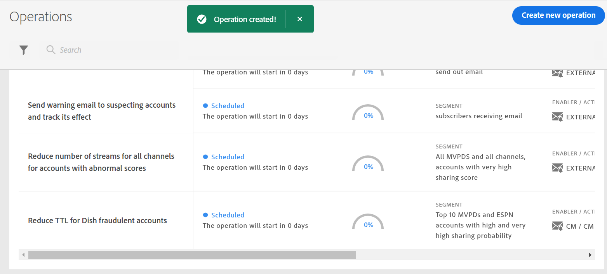

# 对用户区段创建操作 {#operation-to-track-segment}

帐户IQ中的每个报表页面都具有 **创建新操作** 选项，帮助您创建工作流以自动（并简化）对订阅者帐户执行各种（批量）操作；定义规则以指定示例、定义操作，以及记录和分析这些操作的效果。 在要创建操作的页面上，您可以定义要执行操作的用户组的示例，并计划在将来的日期运行该操作。

要创建操作，请执行以下操作：

1. 使用 [定义区段和时间范围](/help/AccountIQ/howto-select-segment-timeframe.md).

1. 选择 **创建新操作** 选项。 的 **创建新操作** 页面。

   
   *图：用于创建新操作的页面*

1. 在 **创建新操作** 页面上，在表单字段中填写详细信息，以便：

   * [操作名称](#operation-details) 操作详细信息中
   * 在下运行操作的区段 [目标区段](#segment) 并使用 [其他区段](#additional-segmentation)
   * [区段类型](#segment-type) 在 [目标区段](#segment)
   * [操作](#action)
   * [计划激活](#schedule)

1. [保存操作](#save-operation).

## 操作详细信息 {#operation-details}

将新操作命名为 **操作名称** 字段。 例如，“*测试多因素身份验证对MVPD X订阅者的影响”或“限制并发监控中的流数量”或“限制MVPD D的订阅者查看20多台设备的信道“N”*&quot;

## 目标区段 {#segment}

的 **区段** 此处定义了将由此操作操作的用户；或操作的示例组。 默认区段为 **区段** 您选择的 [区段和时间范围面板](/help/AccountIQ/howto-select-segment-timeframe.md) 在主报表或功能板页面上。

<!--* The first segment entry in the **Segment** section, by default, shows the **segment** you selected in the step 1.

* The **segment evaluation period** is the time period of analysis you selected in step 1 from **Granularity and Timeframe** option.

*Figure: Segment and timeframe selection on the main page*-->

此区段定义受所创建操作影响的MVPD和渠道的订阅者。 例如，您的（默认）区段包括 *查看频道“N体育”的MVPD的所有用户帐户均名为“C”*.

### 其他区段 {#additional-segmentation}

此外，您还可以通过添加更多量度来优化目标区段。 例如，您可以添加大于90%的共享概率作为其他量度。 现在问题陈述是 *“为名为“C”的MVPD的用户帐户创建操作，这些用户帐户正在查看共享概率大于90%的频道“N个体育”。”*.

*图：其他区段*

此外，如果通过为设备数量添加其他量度来优化操作，则更新的问题语句会读取 *“为名为“C”的MVPD的用户帐户创建操作，这些用户帐户正在查看共享得分超过90分的频道“N个体育”，并且在评估期间使用5个以上的设备来查看内容。”*.

*图：通过总体共享分数和设备数量量度优化了示例区段*

这样，用户组就变得更加精细。 因此，通过添加更多量度和条件，您可以进一步限定区段定义要运行的帐户。

### 区段类型 {#segment-type}

区段类型是在整个工序评估期间处理区段的方式。

*图：使用区段类型优化要运行的区段数量*

<!--The segment type option allows you to further refine your segment based on the evaluation period (or time).

**Fixed number of accounts** 

When you select **Fixed number of accounts** segment type, then you need to specify an evaluation period as well.

By doing so, you are fixing the sample size for evaluation in terms of numbers. You are making Account IQ identify a specific set of users (that meet the criteria of defined evaluation period and segment metrics) to operate on. The analysis and graphs will be generated for this specific set of users only (identified initially) throughout the operation.

**Variable number of accounts**

When you select **Variable number of accounts** segment type, you do not limit the number of accounts in segment. The accounts which fall under the defined segment metrics are the part of the segment, and the number of accounts will change continuously during the course of operation.-->

>[!IMPORTANT]
>
>您只能使用 **固定帐户数** 选项。 要选择的选项 **帐户的变量数** 将在即将发行的版本中提供。

<!--

you tell Account IQ in the beginning of the operation which number of accounts to operate on.

Account IQ system only has a segment definition, and during the operation it looks into all the accounts that fit that segments.

the number of accounts in segment is not limited, the accounts that fall under defined segment metrics will be part of the segment, and the no of accounts will change continuously, as there are no specific limitations - like an evaluation period in the past.When the segment is defined (which in this example is, subscriber accounts of MVPD 'C' who are viewing the channel 'N Sports' that have a sharing score above 80 and are using 10 different IPs) and we also identified a time period to evaluate a segment. This identifies X number of accounts as sample (for example 5000). How many devices they are using?
It identifies x-number of accounts (5000)...a very specific set of users that meet this criteria.
for every period that we schedule (within that operation) during that operation) we will look at those 5K users that are originally identified and we will present graph about them. How are the sharing scores coming up?u We identified a period. Are their sharing scores going up? Are there fewer of them who are meeting this definition?
Fixed versus variable is the way the treated in fixed or variable way.

1. we identified a fixed set of accounts.
2. we evaluate those specific accounts on criteria throughout the operation.

General idea independent of graph is that we will evaluate a set of accounts identified initially, for no of periods during operation and generate graphs against that.
Those are the 5000 users for which I will create graphs for for every period of the operation.

**Variable number of accounts**
We do not identify any initial set of accounts, we just have a segment definition.
Each period during the operation, we go and look into all the accounts that fit that segments.
If it is not a fixed segment, I won't initially evaluate it. I won't have an initial set of 5000. Instead at every period during the evaluation I will evaluate the segment then, and then I will produce graph about the next 3000 users.
the......will vary from period to period.

if not fixed segment, then I won't initially evaluate or have initial set of 5000, instead at every period during an operation and the.-->

## 操作 {#action}

的 **操作** 定义要对定义的区段执行的操作。

您可以执行两种类型的操作：

* 使用与帐户IQ集成的系统执行操作；例如 [并发监控](https://tve.helpdocsonline.com/concurrency-monitoring-introduction)<!--, or Adobe Target-->.

* 用于创建和处理对帐户IQ以外而未与帐户IQ系统集成的工作流的操作。 例如，频道程序员“N”向MVPD“C”的所有订阅者发送批量电子邮件的操作。

>[!NOTE]
>
>通过创建操作，您不仅可以指定操作并定义其范围，还可以开始记录这些操作的效果。

## 计划{#schedule}

您可以通过设置开始和结束日期来安排操作的激活。

>[!NOTE]
>
>开始日期和结束日期的粒度与您在使用 **区段和时间范围面板**，在步骤1中。
>
>
>因此，如果您选择粒度为“周”，则开始和结束日期将以周为单位（例如“周14”）；如果选择粒度为“月”，则开始日期和结束日期按月计算。

>[!IMPORTANT]
>
>开始日期必须晚于评估期，也晚于当前日期。 同样，结束日期也必须晚于开始日期和当前日期。

### 保存操作 {#save-operation}

保存操作时，会显示一个消息屏幕，通知您在此操作中定义的区段也将保存，以供将来使用。 但是，您需要命名此区段。

*图：保存操作并指定区段名称*

>[!NOTE]
>
>最佳做法是根据您要执行的操作以及要执行的操作的区段来命名操作。

<!--In future you can select this saved segment when defining a segment for your analysis on the main reports page. Moreover, the saved segment is also listed when you create an operation the next time.

*Figure: Saved segments in segment selector on Create new operations page* 

>[!IMPORTANT]
>
>When creating an operation, if you select a segment that was previously created then you cannot add new metrics to it and refine it.
>
>Adding new metrics creates a new segment, but you cannot modify an existing segment.-->

创建操作后，该操作将从开始日期运行到您指定的结束日期。

您保存的操作的详细信息可在主 [操作](/help/AccountIQ/operations.md) 页面。

*图：新创建的操作将列在主“操作”页面上*
