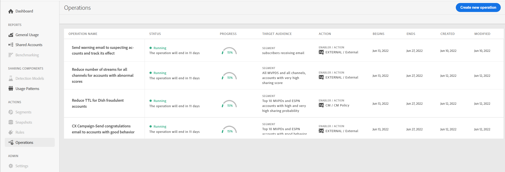
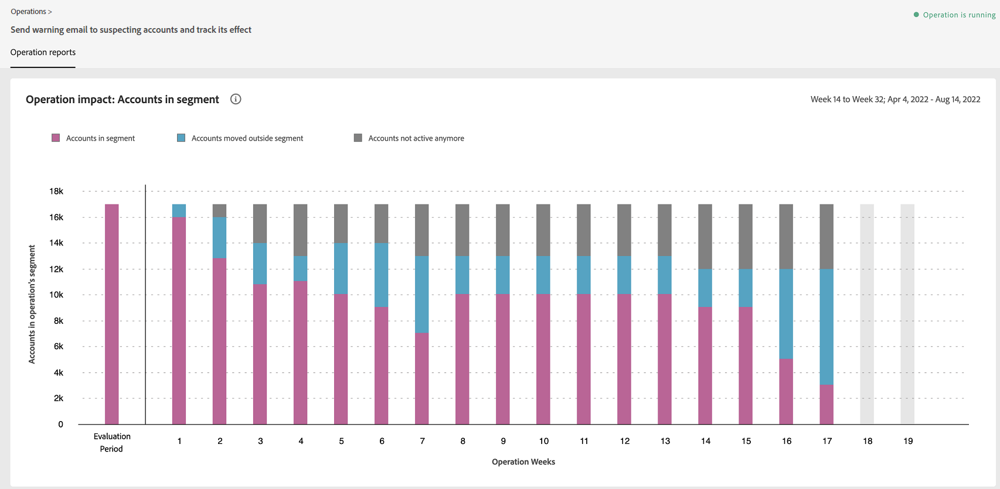

# 操作 {#operations-tab-next-steps}

了解订阅者的使用模式并识别选定区段的密码共享（使用帐户IQ中的Reports &amp; Analytics）后，您可以针对目标采取有针对性的操作以缓解密码共享。

帐户IQ中的“操作”功能可帮助您通过称为“操作”的重点过程，有效地处理和管理凭据共享。 它为您提供了多种选项，可为特定的用户组设计目标、根据目标定制定位操作，并在将来的持续时间内自动执行这些操作。 通过操作功能，您不仅可以创建和执行操作，还可以衡量操作的影响。 因此，通过评估影响，您可以调整策略以优化影响，无论是转换借款者还是减少凭据共享。

要查看 **操作** 页面选择 **操作** 选项 **操作** 在帐户IQ应用程序的左侧导航中。 “操作”页面列出了帐户IQ系统上已存在的所有操作及其详细信息。

*图：帐户IQ中现有操作的列表和详细信息*

在“操作”页面上，您可以：

* 查看帐户IQ中已存在的操作列表

* 查看操作详细信息，如：

   * 状态（已计划、正在运行、已结束、错误或已停止）

   * 进度（完成百分比）

   * 目标受众（要在上运行操作的区段）

   * 计划（开始和结束日期）

   * 操作的创建和结束日期

* [创建新操作](/help/AccountIQ/operation-affecting-user-segment.md)

* [查看操作报表](#operation-reports)

<!--* Search from the list of operations using Search field

* Stop an operation.

* Create a duplicate operation.

* [Configure columns of Operations details page](#configure-columns)-->

## 查看操作报表 {#operation-reports}

您可以通过查看操作报告来分析其影响。 要查看操作的报表，请执行以下操作：

1. 在主“操作”页上选择操作名称。

   报表以堆叠条形图的形式显示。

   

   *图：操作报告，以查看操作的影响*

   x轴绘制评估周期，y轴绘制变量以衡量操作的影响。

   例如，在上图中，y轴上的变量是帐户数。 通过查看该图，您可以比较在操作区段中的帐户数与在特定时间（如操作评估期的第2周）操作区段外的帐户数。 因此，您可以分析评估期间内，操作区段内和区段外的帐户数量有何变化。

   因此，如果您的操作要向有疑心的帐户发送警告电子邮件，并且操作区段中的帐户是共享概率超过90且使用5个以上设备来流内容的帐户，则在评估期开始时，区段中的帐户超过700万。 此数字在图表所示的评估时段内发生更改，从而指示操作的影响。 根据评估结果，您可以对怀疑帐户采取补救措施，或继续操作，或调整策略以获得更好的结果以限制凭据共享。

2. 要关闭报表并返回到主“操作”页面，请选择 **操作** 选项 **操作** 中。

<!--

*Figure: Operation details*
## Configure columns {#configure-columns}

You can select the icon to **Configure columns** on the top of the operations table.

*Figure: Configure columns of Operations details page*-->