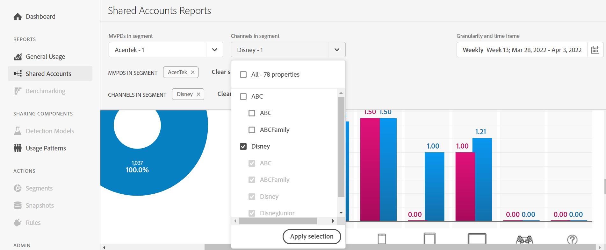
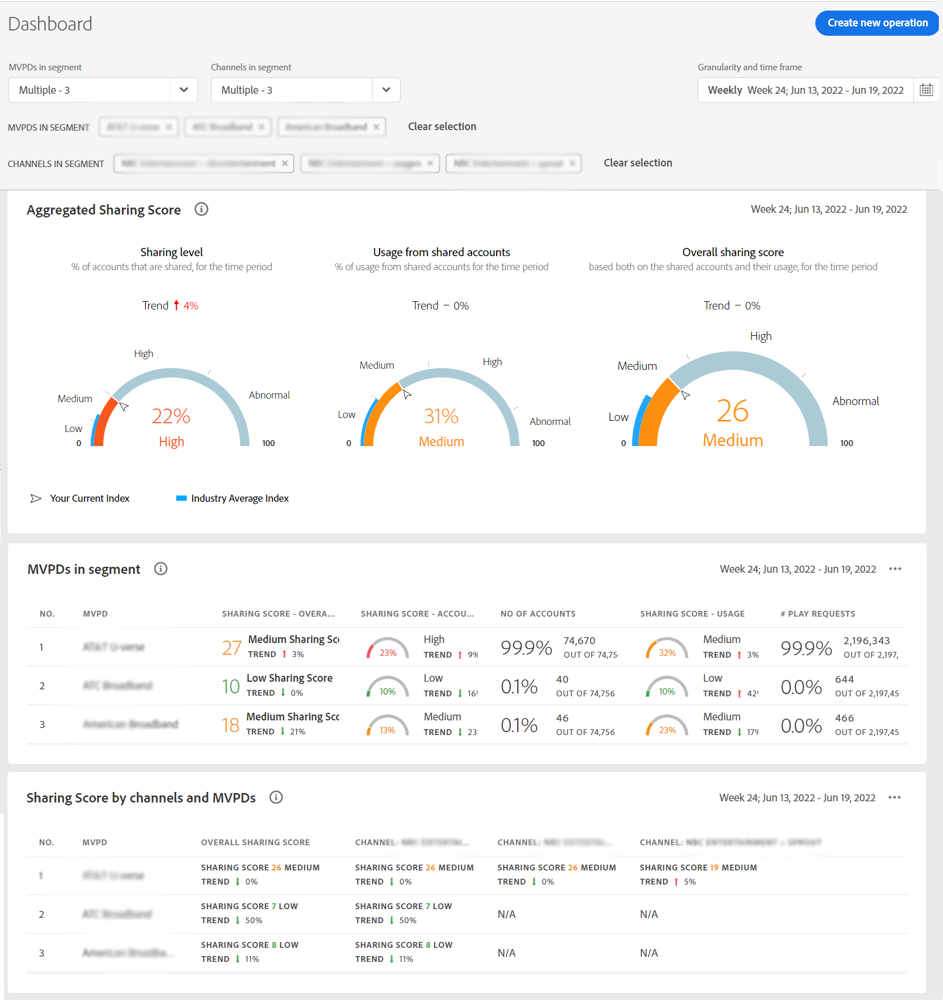

# 查看特定程序员的帐户共享报告 {#report-sp-programmers}

要在帐户IQ中查看报表，请在以MVPD身份成功登录到应用程序后：

1. 在定义要分析和查看报告的订户区段时，选择特定的程序员，步骤如下： [如何定义区段](/help/AccountIQ/howto-select-segment-timeframe.md).

   

1. 从左侧导航中选择所需的报表页面：

* [常规用法](/help/AccountIQ/general-usage-reports.md)

   
* [共享帐户](/help/AccountIQ/shared-acc-reports.md)

   
* [使用模式](/help/AccountIQ/usage-patterns.md)

   

* [仪表板](/help/AccountIQ/dashboard.md) （仪表板可让您从不同的报表页面中一览选定的图表）。

   

每个页面都将反映选定区段的活动。
