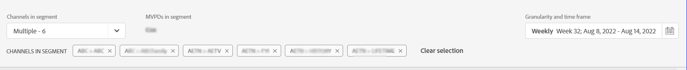

# 订阅者区段和时间范围 {#cohorts-segments}

登录Account IQ时，顶部有一个面板，可让您定义订阅者 [区段](/help/AccountIQ/product-concepts.md#segment-segmet-def) 筛选结果以查看订阅者共享行为和模式的报表。

<!---->

+++程序员的区段选择面板

<!---->

以下下拉选项用于定义区段：

**区段中的MVPD**

此 **区段中的MVPD** 选择器可让您选择 [MVPDs](/help/AccountIQ/product-concepts.md#mvpd-def) 要为其订阅者查看帐户共享报告的（个人或组）。

在此选择器中，除了选择单个MVPD外，您还可以选择以下组：

* [前10个MVPD（按共享得分）](/help/AccountIQ/product-concepts.md#top-mvpds-def)

* [按使用量列出的10大MVPD](/help/AccountIQ/product-concepts.md#top-mvpds-def)

* [按帐户列出的10大MVPD](/help/AccountIQ/product-concepts.md#top-mvpds-def)

* [隔离模式](/help/AccountIQ/isolation-mode.md)

**区段中的渠道**

当您以程序员用户身份登录时，您可以选择您的渠道以查看其帐户共享分析。 使用 **区段中的渠道** 下拉选项以选择组织中的单个或多个渠道。

+++

+++MVPD的区段选择面板

以下下拉选项用于定义区段：

**区段中的渠道**

此 **区段中的渠道** 通过选择器，可进一步缩小过滤器范围以选择与所选MVPD对应的渠道。

* [前10名程序员（按分享得分）](/help/AccountIQ/product-concepts.md#top-mvpds-def)

* [按使用量列出的10大程序员](/help/AccountIQ/product-concepts.md#top-mvpds-def)

* [按帐户划分的前10名程序员](/help/AccountIQ/product-concepts.md#top-mvpds-def)

**区段中的MVPD**

当您以MVPD用户身份登录时，您的姓名将显示在的字段中 **区段中的MVPD**.

+++

<!--For example, you can define your segment as the "subscribers of the MVPD A that watched the channels X, Y, and Z".-->

## 粒度和时间范围 {#granularity-timeframe}

此 **粒度和时间范围** 通过选择器，可指定要查看订阅者共享行为的日期和持续时间或时间大小。

因此，使用这些控件，您可以将问题语句定义为“5月份观看了频道X、Y和Z的MVPD A订阅者”。

