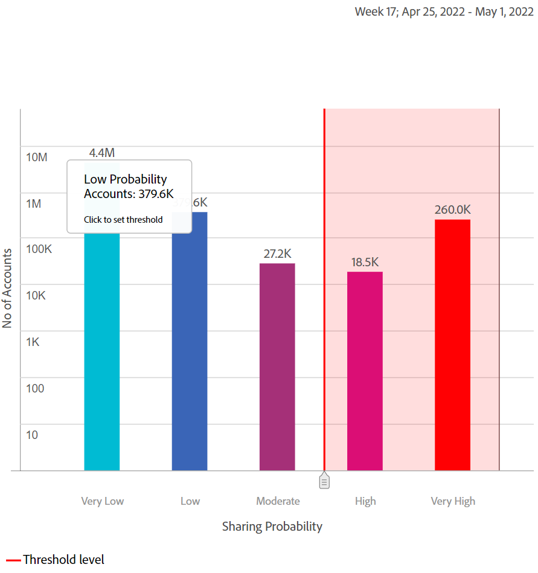
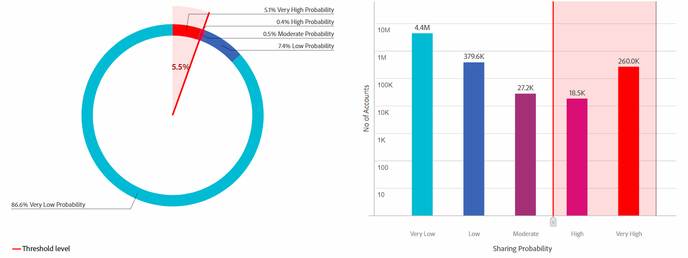
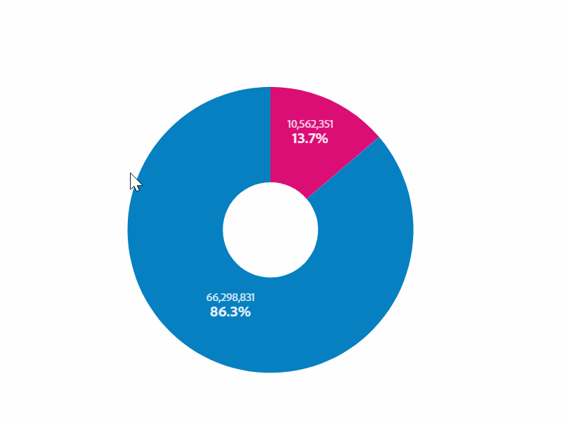
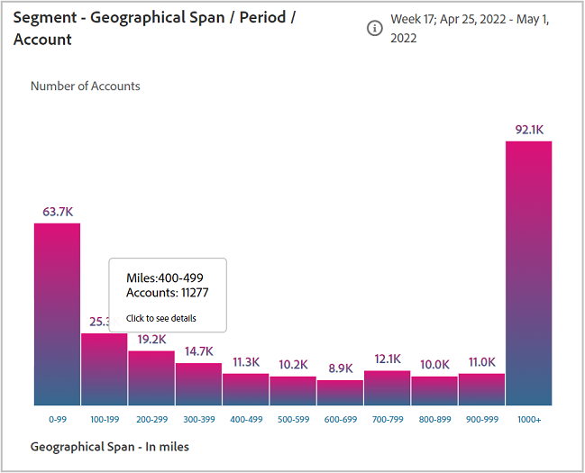

# 共享帐户报表 {#shared-accounts-reports}

“共享帐户报表”按所选的共享概率范围（例如，设备数和设备类型）来划分量度 **超过中等概率** 和 **过低概率** ，用于当前区段。

然后，这些范围可用作用户定义的阈值，并且图表根据所选阈值进行更新。

帐户IQ根据已定义区段的所有订阅者帐户的共享概率，将其分为以下五类：

* 非常高(80%-100%)
* 高(60%-80%)
* 适中(40%-60%)
* 低(20%-40%)
* 非常低(0%-20%)

## 帐户共享概率 {#accounts-sharing-probability}

此处的圆环图按各种概率类别对订阅者帐户的百分比（和绝对数）进行分类和显示。

红线标记用户在 [当前区段中超过阈值的帐户](#threshold-selector) 的上界。

条形图在y轴上绘制各种类别的共享概率的帐户数（在x轴上绘制）。

红线标记阈值范围，并可在条形图中进行调整。 在条形图中调整的阈值反映在圆环图的阈值范围内。

<!---->

### 当前区段中超过阈值的帐户{#threshold-selector}

利用此面板，可选择以下范围作为订阅者帐户的阈值（根据其共享概率）：

* 帐户 **过低** 共享 **概率**

* 帐户 **过低** 共享 **概率**

* 帐户 **审核** 共享 **概率**

* 帐户 **过高** 共享 **概率**

选择阈值后，该面板会显示在区段中选定MVPD的所有订阅者帐户中的帐户百分比（和帐户数）。

## 区段 — 在总请求中播放请求 {#play-request-out-total}

圆环图显示了该区段中订阅者发出的播放请求的百分比（和数量）；和允许您比较未在定义区段中的订阅者发出的播放请求。

当您在圆环图上移动光标时，它还会显示订阅者百分比和来自各种概率范围的数字。

<!---->

## 区段平均每个帐户的设备数{#avg-devices-account}

条形图显示当前区段中的订阅者和当前区段中未订阅者正在使用的每种设备类型的平均设备数。

## 区段 — 每个帐户每个时段的邮政编码 {#zip-codes-period-account}

此图表会通知您某个时间段内从不同位置访问内容的订阅者数量。

您可以放大以缩小并查看绘制一系列位置的图形中条形图的特定内容。

<!---->

## 区段 — 地理范围/期间/帐户 {#geo-span-period-account}

此条形图以英里为单位绘制与不同地理范围范围有关的订阅者帐户数。 该范围基于用户在时间范围内从其流入的位置之间的最大距离。

<!--Total number of users ...

How many accounts are within 99 miles of each other.....and how many are apart. 

Based on points on the map.-->

当您选择表示地理距离范围的栏时，它会扩展该范围以向您显示更多详细信息。

<!---->