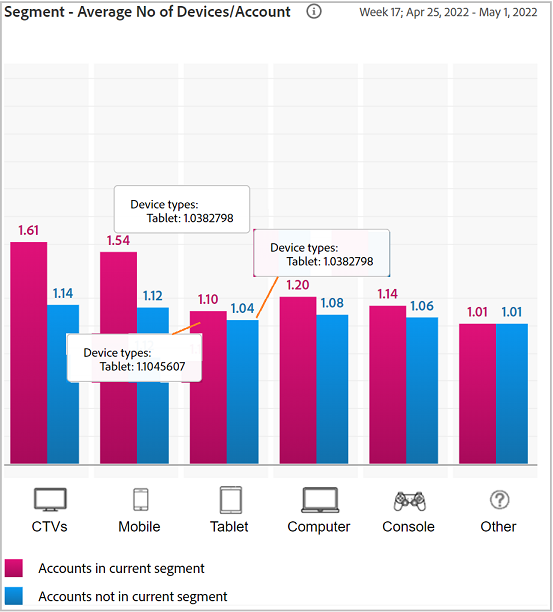

# 共享帐户报表 {#shared-accounts-reports}

共享帐户报表按选定的共享概率范围划分各个量度，例如设备数量和设备类型，例如 **超过中等概率** 和 **超低概率** （当前区段）。

然后，这些范围可用作用户定义的阈值，并且图形会根据所选阈值进行更新。

帐户IQ根据帐户的共享概率，将定义段的所有订阅者帐户分类为具有以下五个类别的帐户：

* 非常高(80%-100%)
* 高(60%-80%)
* 中等(40%-60%)
* 低(20%-40%)
* 非常低(0%-20%)

## 帐户共享概率 {#accounts-sharing-probability}

此处的圆环图分类和显示来自各种概率类别的订阅者帐户的百分比（和绝对数）。

红线标记用户在以下位置选择的阈值范围： [当前区段中的帐户超过阈值](#threshold-selector) 面板。

条形图在Y轴上绘制各种共享概率的帐户数（绘制在X轴上）。

红线标记了阈值的范围，可在条形图中进行调整。 条形图中调整的阈值反映在圆环图的阈值范围内。

<!---->

### 当前区段中的帐户超过阈值{#threshold-selector}

此面板允许您从以下范围中选择一个范围作为订阅者帐户的阈值（基于其共享概率）：

* 帐户 **过低** 共享 **概率**

* 帐户 **过低** 共享 **概率**

* 帐户 **过度** 共享 **概率**

* 帐户 **过高** 共享 **概率**

选择阈值后，该面板将显示所选段中所有订户帐户的帐户百分比（和数量）。

## 区段 — 播放请求总计 {#play-request-out-total}

圆环图显示区段中订阅者发出的播放请求的百分比（和数量）；并允许您比较不在定义的区段中的订阅者发出的播放请求。

当在圆环图上移动光标时，它还会显示来自各种概率范围的订户百分比和数字。

<!---->

## Segment — 每个帐户的平均设备数{#avg-devices-account}

条形图显示当前区段中的订阅者和当前区段以外的订阅者使用的每种设备类型的平均设备数。

## 区段 — 每个帐户每个期间的邮政编码 {#zip-codes-period-account}

此图表告知您在一个时间范围内从不同位置使用内容的订阅者数量。

您可以放大以缩小并查看图形中某条的特定信息，该图形绘制了一系列位置。

<!---->

## 区段 — 地理范围/期间/帐户 {#geo-span-period-account}

此条形图以英里为单位绘制不同地理范围范围的订户账户数量。 该范围基于在时间帧期间订户从其中进行流式传输的位置之间的最大距离。

<!--Total number of users ...

How many accounts are within 99 miles of each other.....and how many are apart. 

Based on points on the map.-->

当您选择表示某个地理距离范围的条形时，它会扩展该范围以显示更多详细信息。

<!---->
