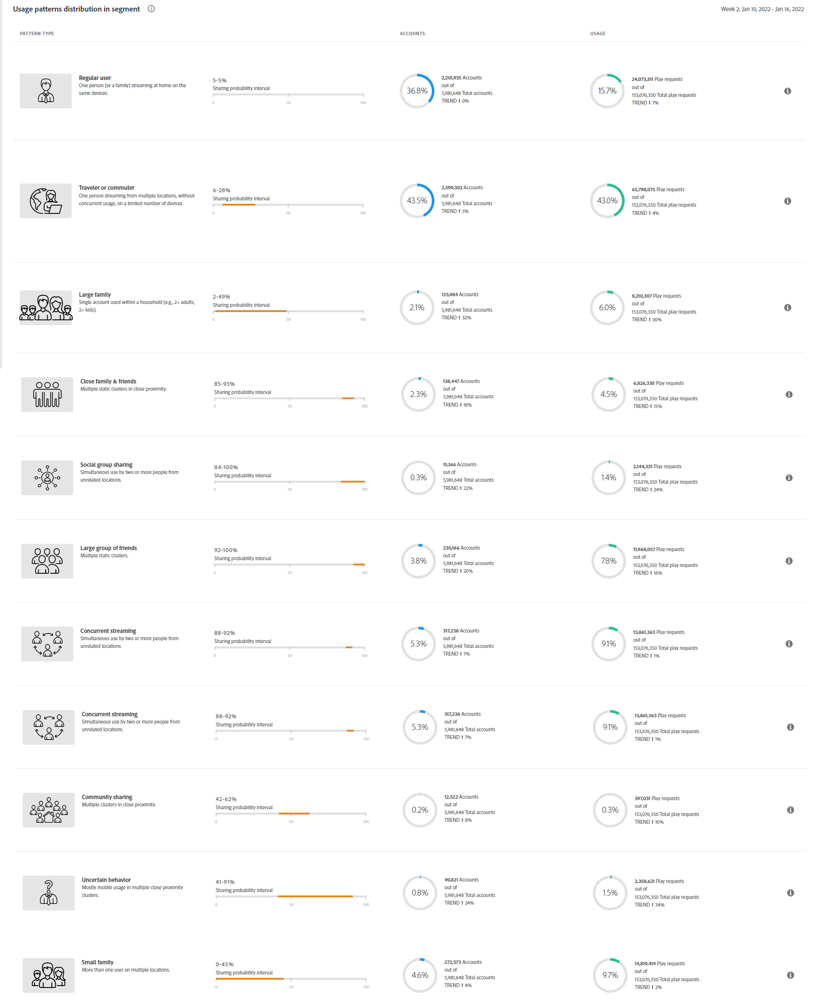

# 使用模式 {#usage-patterns}

帐户IQ根据订阅者帐户的社交行为（如旅行者或通勤者、大家庭和社区共享），将用户分为不同的类别。 的 **使用模式** 页面会针对这些用户分类显示多个不同的分析和报表。 例如， **使用模式分布 — 区段与行业中的用户** 报表比较当前区段与整个行业的使用行为。

与应用程序中的其他页面一样，此处的分析和报表基于 [区段面板](/help/AccountIQ/segments-timeframe.md).

## 使用模式分布 {#usage-pattern-dis}

中的条形图 **使用模式分布 — 区段与行业中的用户** 描述每个社交行为或使用模式的订阅者数量和百分比。 除了将当前区段中的每个使用模式与整个行业进行比较之外，它还会将它们与包含所有渠道的区段进行比较。

## 区段中的使用模式分布(#usage-pattern-dis-segment)

的 **区段中的使用模式分布** 面板可列出每个用户模式的以下信息：

* 共享个人帐户所属的概率范围
* 该模式下的帐户数和百分比
* 按播放请求计算，该类别订阅者的使用总数和百分比

例如，在上图中：

* 定义区段中的常规用户（只有一个位置中设备数量有限的一至少数用户）的帐户共享概率在0%到5%之间。

* 用户账户总数（5 981 648个）中36.8%（2 201 935个）是普通用户。

* 在总播放请求(153,076,350)中，15.7%(24,073,311)是由普通用户发出的。

## MVPD的使用模式分配 {#usage-pattern-dis-mvpd}

的 **MVPD的使用模式分配** 表格提供了当前区段中MVPD的使用模式分布的比较。

