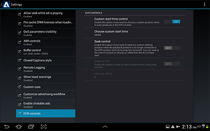

# 在引用实现{#set-a-custom-start-time-in-the-reference-implementation}中设置自定义开始时间

您可以使用“设置”界面中的DVR控件面板来启用和编辑引用实现中的开始位置。 编辑这些参数时，将更新SharedPreferences中的配置并更新播放器。

1. 打开“Primetime设置”对话框。
1. 选择&#x200B;**[!UICONTROL DVR controls]**。

   <!---->

   

1. **如果要在** 进入流 **[!UICONTROL ON]** 时在DVR窗口中选择自定义位置，则自定义开始时间控件必须为。
1. 在&#x200B;**中设置自定义开始时间，选择自定义开始时间**。
