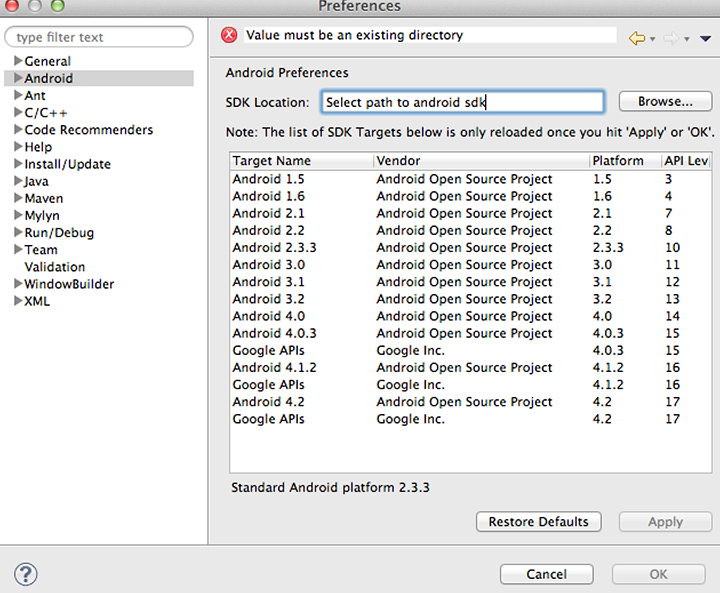

# 下载和配置入门软件 {#download-and-configure-prerequisite-software}

1. 从https://www.oracle.com/technetwork/java/javase/downloads/下载JDK [](https://www.oracle.com/technetwork/java/javase/downloads/)。

   安装过程很简单。 如果系统中已安装JDK，则可以跳过此步骤，但请注意，您的JDK、Eclipse IDE和OS需要兼容。
1. 从https://www.eclipse.org/downloads下载适用于Java开发人员的Eclipse IDE [](https://www.eclipse.org/downloads)。

   解压包后，您可以直接运行Eclipse。 没有安装程序。
1. 从https://developer.android.com/sdk/index.html下载Android SDK ADT包 [](https://developer.android.com/sdk/index.html)。

   此捆绑包包括Eclipse。 如果您的系统中已安装Eclipse，则可以从部分下载适用于您的平台的SDK工 [!UICONTROL Use An Existing IDE] 具。

   拆开包装并安装到您会记住的位置。 您需要在以后的步骤中引用此内容。
1. 配置Android SDK。
   1. 打开终端（在Mac OS X中）或命令提示（在Windows中）。
   1. 导览至您下载／解压缩Android SDK的目录。
   1. 转到工具文件夹，该文件夹包含一个名为的文件 [!DNL android]。
   1. 运行以下命令：

      * 对于Mac OS X/Unix:

         ```
         chmod +x android 
         android update sdk --no-ui
         ```

      * 对于Windows:

         ```
         android update sdk --no-ui
         ```

         此过程需要一段时间。

1. 配置Eclipse。
   1. 启动Eclipse。

      在Windows上，如果Eclipse未启动，且报告的问题是Eclipse找不到所需的Java文件，请尝试以下操作：

      * 添加 `-vm C:\[path to your JDK bin]\javaw.exe` 到您的 [!DNL eclipse.ini] 文件。
   1. 选择 **[!UICONTROL Help]** > **[!UICONTROL Install New Software]** 。
   1. 单击 **[!UICONTROL Add...]**.
   1. 输入 `Android` 名称。
   1. 输 `https://dl-ssl.google.com/android/eclipse/` 入链接 **[!UICONTROL Work with]** 内容。
   1. 单击 **[!UICONTROL OK]**.

      您应当看到类似于以下对话框：

      

   1. 选择生成的包（开发人员工具和NDK插件中的包），然后单击 **[!UICONTROL Next]**。

      这将下载Android开发工具(ADT)。
   1. 下载完成后，重新启动Eclipse。
   Android SDK现已安装。 1.配置Eclipse，以便它能够找到Android SDK并将其用作资源。
   1. 打开Eclipse。
   1. 选择 **[!UICONTROL Window]** >在 **[!UICONTROL Preferences]** Windows上； **[!UICONTROL ADT]** > **[!UICONTROL Preferences]** on Mac OS X.
   1. 选择选 **[!UICONTROL Android]** 项卡。
   1. 浏览至Android SDK的位置。
   1. 单击 **[!UICONTROL Apply]**.

      


