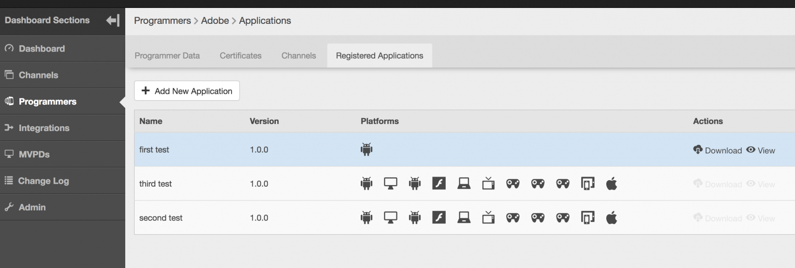
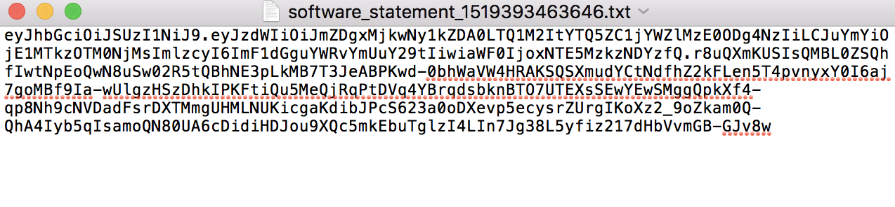

# 动态客户端注册管理 {#dynamic-client-registration-management}

>[!NOTE]
>
>此页面上的内容仅供参考。 使用此API需要获得Adobe的当前许可证。 不允许未经授权使用。

## 概述 {#overview}

随着 [Android Chrome自定义选项卡](https://developer.chrome.com/multidevice/android/customtabs){target_blanck}和 [Apple Safari视图控制器](https://developer.apple.com/documentation/safariservices/sfsafariviewcontroller)在客户的应用程序中，我们正在更新Adobe Primetime身份验证中的用户身份验证流程。 更具体地说，我们无法再实现保持状态的目标，以便能够在重定向之间跟踪验证MVPD订户的用户代理流。 这是以前使用HTTP Cookie完成的。 此限制是开始将所有API迁移到OAuth 2.0的驱动程序 [RFC6749](https://tools.ietf.org/html/rfc6749){target_blanck}。

通过此更新，Adobe身份验证客户端将成为OAuth 2.0客户端，并部署了自定义OAuth 2.0授权服务器以满足Adobe Primetime身份验证服务的需求。

为了客户端应用程序利用OAuth 2.0授权，服务器必须动态注册以获取特定信息（客户端凭据）才能与其交互。 在注册过程中，客户端必须向客户端注册端点显示一组内置元数据。

此元数据作为软件语句传递，其中包含“software_id”，以允许我们的授权服务器使用相同的软件语句关联应用程序的不同实例。

A **软件语句** 是一个JSON Web令牌(JWT)，它将有关客户端软件的元数据值作为包进行声明。 当作为客户端注册请求的一部分提交给授权服务器时，必须对软件语句进行数字签名或使用JSON Web签名(JWS)进行MACed。

您可以在官方文档中找到关于软件语句及其工作方式的更详细说明 [RFC7591](https://tools.ietf.org/html/rfc7591).

软件语句应与用户设备上的应用程序一起部署。

在此更新之前，我们有两种机制允许应用程序执行对Adobe Primetime身份验证的调用：

* 基于浏览器的客户端通过允许的方式进行注册 [域列表](/help/authentication/programmer-overview.md#reg-and-init)
* 本机应用程序客户端(如iOS和Android应用程序)通过进行注册 **签名请求者** 机理

使用客户端注册授权机制，必须将您的应用程序添加到TVE仪表板中。

为了让客户开始实施新的Android SDK和即将推出的iOS SDK，他们需要一份软件声明。 软件语句标识在TVE仪表板中创建的应用程序。

按照以下各节中的步骤，在TVE功能板中创建注册应用程序。

## 创建注册的应用程序 {#create_app}

在TVE功能板中创建注册应用程序的方法有两种：

* [程序员级别](#prog-level)  — 允许您创建注册应用程序并将其链接到任何或所有程序员渠道。

* [渠道级别](#channel-level)  — 允许您创建仅永久链接到此渠道的注册应用程序。

### 在程序员级别创建注册应用程序 {#prog-level}

转到 **程序员** > **注册的应用程序** 选项卡。

在注册的应用程序选项卡中，单击 **添加新应用程序**. 在新窗口中填写必填字段。

如下图所示，您应填写的字段包括：

* **应用程序名称**  — 应用程序的名称

* **分配给渠道**  — 渠道的名称，t此应用程序链接到的。 下拉蒙版中的默认设置为 **所有渠道。** 利用界面，可选择一个渠道或所有渠道。

* **应用程序版本**  — 默认情况下，此参数设置为“1.0.0”，但我们强烈建议您使用自己的应用程序版本对其进行修改。 最佳做法是，如果您决定更改应用程序的版本，请通过为其创建新的注册应用程序来反映该版本。

* **应用程序平台**  — 要链接的应用程序的平台。 您可以选择全部或多个值。

* **域名**  — 要链接的应用程序的域。 下拉列表中的域是所有渠道中所有域的统一选择。 您可以选择从列表中选择多个域。 域的含义是重定向URL [RFC6749](https://tools.ietf.org/html/rfc6749). 在客户端注册过程中，客户端应用程序可以请求允许使用重定向URL来最终化验证流。 当客户端应用程序请求特定的重定向URL时，将针对与此软件语句关联的此注册应用程序中列入白名单的域验证该URL。

在用相应的值填写字段后，必须单击“完成”，才能将应用程序保存在配置中。

请注意， **没有修改已创建应用程序的选项**. 如果发现创建的内容不再满足要求，则需要创建新的注册应用程序并将其与满足要求的客户端应用程序一起使用。

### 在渠道级别注册新应用程序 {#channel-level}

要在渠道级别创建已注册的应用程序，请导航到“渠道”菜单，然后选择要为其创建应用程序的应用程序。 然后，在导航到“已注册的应用程序”选项卡后，单击“添加新应用程序”按钮。

如下所示，与在程序员级别执行的相同操作相比，此处略有不同的是“分配的渠道”下拉列表，该下拉列表未启用，因此没有选项将注册的应用程序绑定到当前渠道之外的其他渠道。

## 列出应用程序 {#list-reg-app}

在创建注册的应用程序之后，可以获取软件语句以作为请求的一部分呈现授权服务器。

可以通过导航到创建注册应用程序的程序员或渠道（在渠道中列出这些应用程序）来完成此操作。 

如下所示，列表中的每个条目都将由其绑定到的平台的名称、版本和符号来标识。

对于其中的每个，您可以：

* [查看](#view)
* [下载软件语句](#download-statement)

### 查看注册的应用程序 {#view}

在应用程序列表中，选择一个应用程序并单击“查看”按钮，将显示创建应用程序时使用的详细信息。 如前所述，没有可修改任何内容的选项。

### 下载软件语句 {#download-statement}

单击需要软件语句的列表项上的“下载”按钮将生成文本文件。 此文件将包含类似于以下示例输出的内容。

文件的名称通过以“software_statement”为前缀并添加当前时间戳来唯一标识。

请注意，对于同一注册的应用程序，每次单击下载按钮时都会收到不同的软件语句，但这并不会使之前为此应用程序获取的软件语句失效。 之所以会出现这种情况，是因为它们是根据操作请求当场生成的。

有一个 **限制** 关于下载操作。 如果在创建注册的应用程序后不久单击“下载”按钮来要求提供软件语句，并且尚未保存该语句，并且配置json未同步，则以下错误消息将显示在页面底部。 

这会封装从核心收到的HTTP 404 Not Found（未找到）错误代码，因为注册应用程序的ID尚未传播，且核心不知道该ID。

解决方案是，在创建注册的应用程序后，最多等待2分钟，以便同步配置。 发生此情况后，将不再收到错误消息，并且将可下载包含软件语句的文本文件。

有关端到端流程的工作原理的详细信息，或者为了深入了解请求的执行方式以及预期的响应，请参阅以下相关信息中的链接以及其他有用链接。

<!--
## Related Information {#related}

* [Dynamic Client Registration API](/help/authentication/dynamic-client-registration-api.md)
* [TVE Dashboard User Guide](/help/authentication/tve-dashboard-user-guide.md)
-->

## 功能演示 {#tutorial}

请看 [此网络研讨会](https://my.adobeconnect.com/pzkp8ujrigg1/) 它提供了功能的更多上下文，并包含一个演示，介绍如何使用TVE Dashboard管理软件语句，以及如何使用Adobe作为Android SDK的一部分提供的演示应用程序来测试生成的语句。
