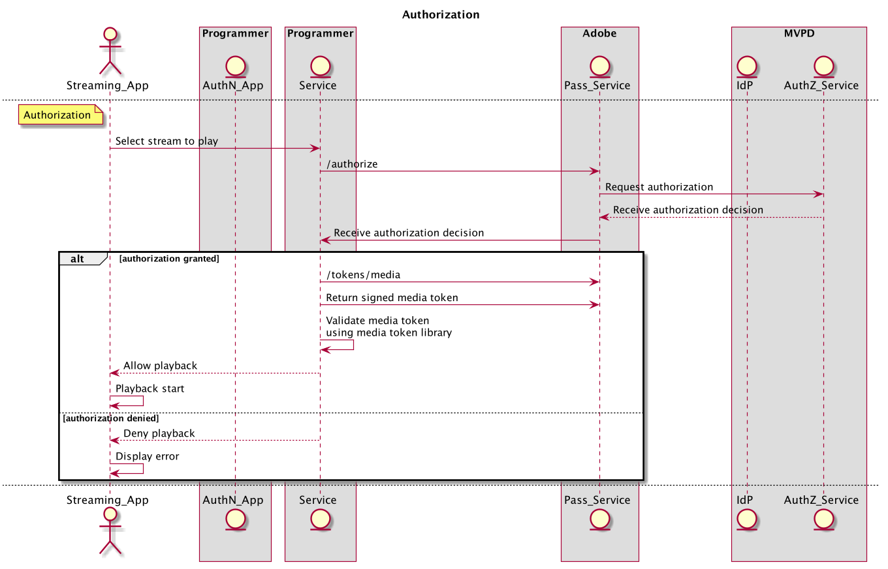

# REST API指南（服务器到服务器） {#rest-api-cookbook-server-to-server}

>[!NOTE]
>
>此页面上的内容仅供参考。 使用此API需要来自Adobe的当前许可证。 不允许未经授权使用。

## 概述 {#overview}

本Cookbook文档的目的是详细介绍使用服务器到服务器体系结构实施Adobe Primetime身份验证的最佳实践。  它提供了生产环境和操作的基本要求、分步流程实施以及一般注意事项。

## 组件 {#components}

在工作中的服务器到服务器解决方案中，涉及到以下组件：

| 类型 | 组件 | 描述 |
| --- | --- | --- |
| 流设备 | 流应用程序 | 驻留在用户流设备上并播放经过验证的视频的程序员应用程序。 |
| | \[Optional\]身份验证模块 | 如果流设备具有用户代理（即Web浏览器），则AuthN模块负责在MVPD IdP上验证用户。 |
| \[可选\]身份验证设备 | AuthN应用程序 | 如果流设备没有用户代理（即Web浏览器），则AuthN应用程序是程序员Web应用程序，可使用Web浏览器从单独的用户设备访问。 |
| 程序员基础架构 | 程序员服务 | 将流设备与Adobe Pass服务链接以获取身份验证和授权决策的服务。 |
| Adobe基础架构 | Adobe Pass服务 | 与MVPD IdP和AuthZ服务集成并提供身份验证和授权决策的服务。 |
| MVPD基础架构 | MVPD IdP | MVPD端点，提供基于凭据的身份验证服务以验证其用户的身份。 |
| | MVPD AuthZ服务 | MVPD端点，根据用户的订阅、家长控制等提供授权决策。 |

流中使用的其他术语定义于
[术语表](/help/authentication/glossary.md).

## 流 {#flows}

### 动态客户端注册(DCR)

Adobe Pass使用DCR来保护程序员应用程序或服务器与Adobe Pass服务之间的客户端通信。 DCR流程是独立的、从属的和先决条件流程，可以在 [动态客户端注册](/help/authentication/dynamic-client-registration.md).

### 身份验证(authN)

身份验证流用于允许用户向其MVPD标识自己，以确定用户是否具有有效的帐户。

1. 用户启动流设备应用程序，并尝试登录或查看受保护的内容。
2. 流设备应用程序向程序员服务发出请求，以确定设备是否已验证。
3. 程序员服务使用DCR注册应用程序。
4. 程序员服务通过调用Adobe Pass服务来检查流设备身份验证状态 **检查** API。
5. 对于 **检查** 调用会返回用户设备已完成身份验证的状态，然后应用程序可以继续运行授权流程。
6. 对于 **检查** 调用会返回以下状态：用户设备未经身份验证，则应用程序应等待用户请求登录。
7. 当用户请求直接登录（例如，选择登录按钮）或间接登录（例如，在尚未验证时选择受保护内容）时，流式设备应用程序向程序员服务发出请求以启动用户验证。 程序员服务通过调用Adobe Pass服务来请求和接收唯一注册代码(regcode) **regcode** API。
8. 程序员服务还会通过调用Adobe Pass服务来检索当前MVPD和属性的列表 **config** API。 注意：此API还可以在流中更早地调用并缓存。
9. Programmer Service将regcode返回到流设备应用程序，并返回步骤\#7中请求的已处理MVPD列表。 注意：已处理的MVPD列表格式由程序员指定，并且可以过滤为明确允许或阻止特定的MVPD（即允许或阻止列表）。
10. 如果与AuthN设备（即“第二个屏幕”）不同，则无论出于选择还是必要（即流设备不支持用户代理），流设备都应显示注册码和URI，以便用户访问AuthN应用程序。 用户将URI键入到AuthN设备上的用户代理以启动AuthN应用程序，然后将注册码键入该应用程序。 如果流设备与AuthN设备相同，则可以通过编程方式将regcode传递到AuthN模块。
11. AuthN模块通过显示MVPD选取器来启动对MVPD的用户验证。 用户选择MVPD后，AuthN模块调用 **身份验证** ，这会将用户代理重定向到MVPD IdP。 当用户使用MVPD成功进行身份验证时，用户代理将被重定向回Adobe Pass服务，其中使用注册码记录成功的身份验证，然后被重定向回AuthN模块。
12. 如果流设备与AuthN设备不同，则AuthN设备应向用户显示成功的身份验证消息以及继续执行的步骤(例如“Success\！ 现在，您可以返回游戏主机以继续\[...\]&quot;)。 如果流设备与AuthN设备相同，则流设备可能会以编程方式检测验证完成。

下图说明了身份验证流程：

### 授权(authZ)

授权流用于确定用户是否有权访问请求的内容。

1. 每次用户尝试在流设备应用程序上查看受保护内容时，流设备应用程序都会调用程序员服务来识别内容并请求启动流所需的权限和信息。
1. 程序员服务调用Adobe Pass **授权** 传递资源ID以及其他所需参数的API。 Adobe服务使用资源ID调用MVPD AuthZ服务，并接收和授权决策，该决策随后传递回程序员服务。 Adobe Pass服务将在可配置的时段内缓存此授权决策。 在后续的 **授权** 如果从程序员服务调用Adobe Pass服务，则只要缓存值有效，都将返回该值。
1. 如果获得授权，程序员服务应调用Adobe Pass **/令牌/媒体** API将返回已签名的媒体令牌。 程序员服务应使用媒体令牌验证器库(JAR)验证媒体令牌。 如果有效，程序员服务应返回权限以及启动步骤\#1中请求的流（例如流URL）所需的权限。
1. 如果授权被拒绝， **授权** 调用将向程序员服务返回错误代码和说明。 在步骤\#1中，程序员服务应将错误代码和说明（或程序员修改的消息）返回给请求。

下图说明了授权流程：

### 注销

注销流允许用户删除当前与应用程序关联的标识。

1. 当用户请求注销（即，从设备中删除与应用程序关联的当前MVPD帐户）时，流式设备应用程序会调用程序员服务，通知其注销设备。
1. 程序员服务应调用Adobe Pass **注销** API。

下图说明了注销流程：

### \[可选\]预授权（也称为预检）

预授权可用于根据一组资源快速确定用户可能具有访问权限的资源。  此调用的结果通常用于为单个用户自定义UI。

1. 一旦用户被认证，流设备可以调用程序员服务来请求用户有权流向其的内容。

1. 程序员服务应调用Adobe Pass **预授权** 带有资源ID列表的API，资源ID是一个简单字符串，通常表示用户可能有权利进行流的渠道。 *注意：目前，* ***预授权*** *调用配置为将列表限制为五(5)个资源ID。 当需要超过5个资源时，多个* ***预授权*** *可以发出调用，也可以将调用配置为通过来自MVPD的协议接受五个以上的资源。 实施人员应牢记* ***预授权*** *调用MVPD资源以及程序员的响应时间，并明智地构建其调用的结构。*

1. 此 **预授权** 调用将通过一个JSON对象来响应程序员服务，该对象包含请求中每个资源ID的TRUE或FALSE值，以指示用户是否有权使用关联的渠道。 *注：如果MVPD不提供给定资源ID的答案（例如，由于网络错误或超时），该值将默认为FALSE。*

1. 程序员服务应使用 **预授权** 调用响应以创建针对流设备的程序员定义的自定义响应，通常用于根据用户的权限个性化用户的演示。

下图说明了预授权流程：

### \[Optional\]元数据

元数据可用于检索MVPD共享的用户信息。
例如，用户ID、邮政编码等。

1. 用户进行身份验证后，程序员服务可能会调用Adobe Pass **用户元数据** 用于请求有关经过身份验证的用户的信息的API。

1. 响应将包含给定用户可用的所有元数据。 每个程序员/MVPD集成的特定字段单独配置。

下图说明了预授权流程：

## 环境和功能要求{#environments}

程序员应至少创建两个环境：一个用于生产，一个或多个用于暂存。

### 生产

生产环境应具有高可用性，并且可适应较大的或意外的尖峰（例如，实时运动、突发新闻）。

Adobe Pass服务运行于分布在美国各地的多个数据中心上。  为了从Adobe Pass服务获得最佳响应时间（即最低的延迟），程序员还应创建类似的地理位置分散的服务基础架构。

如果Adobe需要重新路由流量，程序员服务应将DNS缓存限制为最多30秒。 如果数据中心不可用，则可能会发生这种情况。

程序员应提供生产环境的公共IP范围。 这些将输入到Adobe Pass基础架构中的IP允许列表以进行访问，并由Adobe的公平API使用策略进行管理。

### 暂存

暂存环境可以是最小的，但应包括所有系统组件和业务逻辑。 其功能应该与生产环境类似，并且允许在生产环境之外测试版本。 理想情况下，暂存环境可以连接到Adobe Pass测试环境以供程序员使用，并在需要时通过Adobe进行连接，以便我们协助测试和故障排除。

### 功能要求

程序员服务必须为其正在执行流的设备传递准确的设备识别信息。 此外，程序员服务必须传递正在为其执行流的设备的IP（在x-forwarded-for标头中）以及连接源端口（在设备信息字段中）：

    **X-Forwarded-For ： \&lt;client _ip=&quot;&quot;>**
    
    其中\&lt;client _ip=&quot;&quot;> 是客户端的公共IP地址
    
    
    
    需要在**regcode**和**authorize**调用中添加标头
    
    示例：
    
    POST/reggie/v1/{req\_id}/regcode HTTP/1.1
    
    X-Forwarded-For：203.45.101.20
    
    
    
    GET/api/v1/authorize HTTP/1.1
    
    X-Forwarded-For：203.45.101.20

程序员服务应发送单个MVPD或集成应用程序所需的数据和格式（例如设备IP、源端口、设备信息、MRSS、可选数据，如ECID）。 <!--Please see the documentation for [Passing Device and Connection Information Cookbook](http://tve.helpdocsonline.com/passing-device-information-cookbook)-->.

在缓存时，程序员服务必须遵守authN和authZ TTL，并在收到通知时，使authN或authZ会话失效。

程序员必须维护与Adobe共享的证书。

<!--
## Related Information {#related}

* [REST API Reference](/help/authentication/rest-api-reference.md)
* [Glossary of Terms](/help/authentication/adobe-pass-glossary.md)
-->
