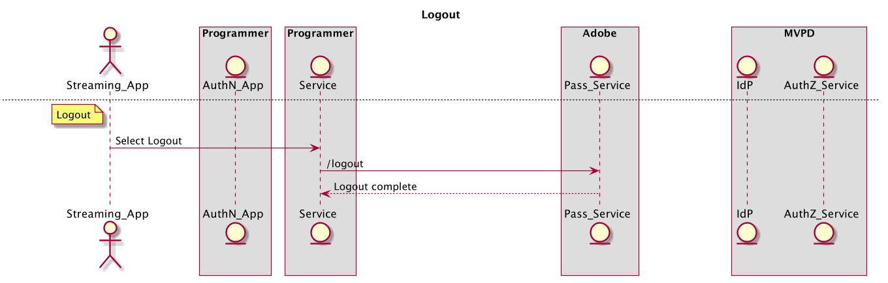

# REST API指南（服务器到服务器） {#rest-api-cookbook-server-to-server}

>[!NOTE]
>
>此页面上的内容仅供参考。 使用此API需要来自Adobe的当前许可证。 不允许未经授权的使用。

## 概述 {#overview}

本指南文档旨在详细介绍使用服务器到服务器体系结构实施Adobe Primetime身份验证的最佳实践。  它提供了生产环境和操作的基本要求、分步流程实施和一般注意事项。

 

## 组件 {#components}

在可用的服务器到服务器解决方案中，涉及以下组件：

 
|类型 |组件 |描述 | | — | — | — | |流设备 |流应用程序 |驻留在用户流设备上并播放经过身份验证的视频的程序员应用程序。 | | | \[可选\]身份验证模块 |如果流设备具有用户代理（即Web浏览器），则AuthN模块负责在MVPD IdP上验证用户。 | | \[可选\]身份验证设备 | AuthN应用程序 |如果流设备没有用户代理（即Web浏览器），则AuthN应用程序是使用Web浏览器从单独用户的设备访问的程序员Web应用程序。 | |程序员基础架构 |程序员服务 |将流设备与Adobe Pass服务链接以获取身份验证和授权决策的服务。 | |Adobe基础架构 |Adobe Pass服务 |与MVPD IdP和AuthZ服务集成并提供身份验证和授权决策的服务。 | | MVPD基础架构 | MVPD IdP |提供基于凭据的身份验证服务以验证其用户身份的MVPD端点。 | | | MVPD AuthZ服务 |一个MVPD端点，可根据用户的订阅、家长控制等提供授权决策。 |

流中使用的其他术语定义于
[术语表](/help/authentication/glossary.md).

## 流 {#flows}

### 动态客户端注册(DCR)

Adobe Pass使用DCR来保护程序员应用程序或服务器与Adobe Pass服务之间的客户端通信。 DCR流程是独立的、依赖的以及必备的流程，可以在 [动态客户端注册](/help/authentication/dynamic-client-registration.md).

### 身份验证(authN)

身份验证流用于允许用户向其MVPD标识自己，以确定用户是否具有有效的帐户。 

1. 用户启动流设备应用程序，并尝试登录或查看受保护的内容。
2. 流媒体设备应用程序向程序员服务发出请求，以确定设备是否已验证。
3. 程序员服务使用DCR注册应用程序。
4. 程序员服务通过调用Adobe Pass服务来检查流设备身份验证状态 **检查身份验证** API。
5. 对于 **检查身份验证** 调用会返回用户设备已通过身份验证的状态，然后应用程序可以继续执行授权流程。
6. 对于 **检查身份验证** 调用会返回用户设备未经过身份验证的状态，因此应用程序应等待用户请求登录。
7. 当用户请求直接登录（例如，选择登录按钮）或间接登录（例如，在尚未经过身份验证时选择受保护内容）时，流设备应用程序向程序员服务发出请求以启动用户身份验证。 程序员服务通过调用Adobe Pass服务来请求和接收唯一注册代码(regcode) **regcode** API。
8. 程序员服务还会通过调用Adobe Pass服务来检索当前MVPD和属性的列表 **config** API。 注意：此API也可以在流的早期调用并缓存。
9. 程序员服务将注册码返回到流设备应用程序，并返回步骤\#7中请求的已处理MVPD列表。 注意：已处理的MVPD列表格式由程序员指定，并且可以过滤以明确允许或阻止特定的MVPD（即允许列表或阻止列表）。
10. 如果由于选择或需要（即流设备不支持用户代理）而与AuthN设备（即“第二个屏幕”）不同，则流设备应显示注册码和URI，以便用户访问AuthN应用程序。 用户在AuthN设备上的用户代理中键入URI以启动AuthN应用程序，然后在该应用程序中键入注册码。 如果流设备与AuthN设备相同，则可以通过编程方式将regcode传递到AuthN模块。
11. AuthN模块通过显示MVPD选取器来启动对MVPD的用户验证。 用户选择MVPD后，AuthN模块调用 **身份验证** ，这会将用户代理重定向到MVPD IdP。 当用户使用MVPD成功进行身份验证时，用户代理将被重定向回Adobe Pass服务，其中使用注册码记录成功的身份验证，然后被重定向回AuthN模块。
12. 如果流设备与AuthN设备不同，则AuthN设备应向用户显示成功的身份验证消息并采取措施以继续(例如，“成功\！ 现在，您可以返回游戏主机以继续\[...\]&quot;)。 如果流设备与AuthN设备相同，则流设备可以通过编程方式检测身份验证是否完成。

 

下图说明了身份验证流程：

### 授权(authZ)

授权流用于确定用户是否有权访问请求的内容。

1. 每次用户尝试在流设备应用程序上查看受保护内容时，流设备应用程序都会调用程序员服务，以确定内容并请求启动流所需的权限和信息。
1. 程序员服务调用Adobe Pass **授权** 传递资源ID以及其他所需参数的API。 Adobe服务使用资源ID调用MVPD AuthZ服务，并接收和授权决策，该决策随后传递回编程器服务。 此授权决策将由Adobe Pass服务在可配置的时段内缓存。 在后续 **授权** 从程序员服务调用Adobe Pass服务，只要缓存值有效，就会返回该值。
1. 如果获得授权，程序员服务应调用Adobe Pass **/令牌/媒体** API，它将返回已签名的媒体令牌。 程序员服务应使用媒体令牌验证器库(JAR)验证媒体令牌。 如果有效，程序员服务应返回权限以及启动步骤\#1中请求的流（例如流URL）所需的权限。
1. 如果授权被拒绝， **授权** 调用将向程序员服务返回错误代码和描述。 在步骤\#1中，程序员服务应将错误代码和描述（或程序员修改的消息）返回到请求。

下图说明了授权流程：

### 注销

注销流允许用户删除当前与应用程序关联的身份。

1. 当用户请求注销（即，从设备中删除与应用程序关联的当前MVPD帐户）时，流式设备应用程序会调用程序员服务，告知其注销设备。
1. 程序员服务应调用Adobe Pass **注销** API。

下图说明了注销流程：

### \[可选\]预授权（也称为预检）

预授权可用于从一组资源中快速确定用户可能具有访问权限的资源。  此调用的结果通常用于自定义单个用户的UI。

1. 一旦用户被认证，流设备可以调用程序员服务来请求用户有权流向其的内容。

1. 程序员服务应调用Adobe Pass **预授权** 具有资源ID列表的API，资源ID是一个简单字符串，通常表示用户可能有权利进行流的渠道。 *注意：目前，* ***预授权*** *调用配置为将列表限制为五(5)个资源ID。 当需要五个以上的资源时，多个* ***预授权*** *可以发出调用，也可以将调用配置为通过MVPD的协议接受五个以上的资源。 实施人员应牢记* ***预授权*** *调用MVPD资源以及程序员的响应时间，并明智地构建其调用使用。*

1. 此 **预授权** 调用将通过一个JSON对象来响应程序员服务，该对象包含请求中每个资源ID的TRUE或FALSE值，用于指示用户是否有权使用关联的渠道。 *注意：如果MVPD不提供给定资源ID的答案（例如，由于网络错误或超时），则该值将默认为FALSE。*

1. 程序员服务应使用 **预授权** 调用响应以创建对流设备的程序员定义的自定义响应，通常用于根据用户的权限对用户进行个性化演示。

下图说明了预授权流程：

### \[可选\]元数据

元数据可用于检索由MVPD共享的用户信息。
 例如，用户ID、邮政编码等。

1. 用户通过身份验证后，程序员服务可能会调用Adobe Pass **usermetadata** 用于请求有关经过身份验证的用户的信息的API。

1. 响应将包含给定用户可用的所有元数据。 每个程序员/MVPD集成的特定字段单独配置。

下图说明了预授权流程：

 

 

## 环境和功能要求{#environments}

 

程序员应至少创建两个环境：一个用于生产，一个或多个用于暂存。

### 生产

生产环境应具有高可用性，并且可适应较大的或意外的尖峰（例如，实时运动、突发新闻）。

 

Adobe Pass服务运行于分布在美国各地的多个数据中心上。  为了从Adobe Pass服务获得最佳响应时间（即最低的延迟），程序员还应该创建一个类似的地理位置分散的服务基础架构。 

如果Adobe需要重新路由流量，程序员服务应将DNS缓存限制为最多30秒。 如果数据中心变得不可用，则可能会发生这种情况。\
 

程序员应提供生产环境的公共IP范围。 这些将输入到Adobe Pass基础架构中的IP允许列表以进行访问，并由Adobe的公平API使用策略进行管理。

### 暂存

暂存环境可以是最小的，但应包括所有系统组件和业务逻辑。 它的功能应该与生产环境类似，并且允许在生产环境之外测试版本。 理想情况下，暂存环境可以连接到Adobe Pass测试环境以供程序员使用，并在需要时通过Adobe来使用，以便我们帮助进行测试和故障排除。

### 功能要求

程序员服务必须为其执行流的设备传递准确的设备识别信息。 此外，程序员服务必须传递其正在为其执行流的设备的IP（在x-forwarded-for标头中）以及连接源端口（在“设备信息”字段中）：

    **X-Forwarded-For ： \&lt;client _ip=&quot;&quot;>** 
    
    其中\&lt;client _ip=&quot;&quot;> 是客户端的公共IP地址
    
     
    
    需要在**regcode**和**authorize**调用中添加标头
    
    示例：
    
    POST/reggie/v1/{req\_id}/regcode HTTP/1.1
    
    X-Forwarded-For：203.45.101.20
    
     
    
    GET/api/v1/authorize HTTP/1.1
    
    X-Forwarded-For：203.45.101.20

 

程序员服务应发送单个MVPD或集成应用程序所需的数据和格式（例如设备IP、源端口、设备信息、MRSS、可选数据，如ECID）。 <!--Please see the documentation for [Passing Device and Connection Information Cookbook](http://tve.helpdocsonline.com/passing-device-information-cookbook)-->.

程序员服务必须在缓存时遵守authN和authZ TTL，并在收到通知时使authN或authZ会话失效。

程序员必须维护与Adobe共享的证书。

<!--
## Related Information {#related}

* [REST API Reference](/help/authentication/rest-api-reference.md)
* [Glossary of Terms](/help/authentication/adobe-pass-glossary.md)
-->
