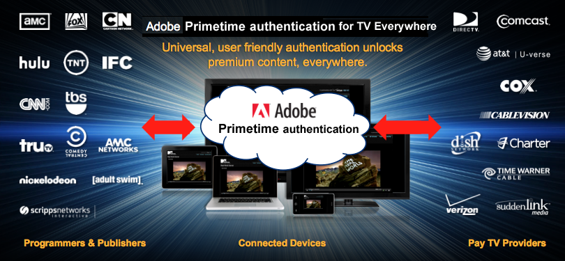

# 关于Adobe Primetime身份验证和随处电视 {#about-auth-tve}

>[!NOTE]
>
>此页面上的内容仅供参考。 使用此API需要来自Adobe的当前许可证。 不允许未经授权的使用。

## 关于所有地方的电视 {#about-tve}

当今的电视观众可以随时随地上网，他们期望自己能够随时访问付费电视内容。 此外，受众使用越来越多的支持Internet的设备查看内容，包括：

* 笔记本电脑
* 平板电脑
* 智能手机
* 网站
* 联合应用程序
* 游戏控制台
* 机顶盒
* 智能电视

TV Everywhere是一个行业运动，它支持付费电视用户通过多种设备访问他们已经在购买的内容，无论是在家里还是外面。 尽管电视观看大部分仍发生在传统的线性电视上，但消费增长发生在时移内容、在线视频和替代屏幕上。 因此，今天的视频分发市场处于一种混乱状态，TV Everywhere已成为协调程序员、付费电视提供商和付费电视订户利益的解决方案。

TV Everywhere的技术目标是使付费电视客户能够访问其所有设备和平台上已订阅的内容。

TV Everywhere的业务目标是：

* **保留现有客户关系并启用新客户关系**
* 允许程序员和内容所有者接触到最广泛的受众，并从高级内容中获得更多价值
* 通过与查看者直接在线互动来扩展品牌

## TV Everywhere挑战 {#tve-challenges}

随处可见的电视机会带来了挑战。 其核心是权利。 在查看者访问订阅内容之前，必须确定他们是否有资格访问该内容。

用户是否订阅了付费电视提供商？ 如果是这样，该订阅是否包含所请求的内容？ 权利对于程序员和内容所有者尤其难以直接确定，因为付费电视运营商拥有其客户的识别数据及其客户的访问权限。

除了权利之外，还有许多相关的技术和集成挑战，包括：

* 制定和实施全面的多设备战略
* 协调程序员和付费电视提供商之间的各种关系
* 防止欺骗性访问或滥用服务条款
* 为跨网站和应用程序的用户提供一致且无挫折的身份验证体验
* 保持快速上市以跟上附属机构交易的步伐
* 管理与多个集成相关的成本

这些挑战使得在程序员和多个付费电视提供商的身份验证系统之间执行和维护复杂、直接的集成非常耗费资源，需要时间和技术上的复杂性。

解决方案？ **Adobe®Primetime身份验证**.

## Adobe Primetime身份验证简介 {#authentication-intro}

借助Adobe Primetime身份验证，程序员和付费电视提供商只需使用Adobe Primetime身份验证API进行简单的集成，即可访问整个生态系统，包括：

* 程序员，如Turner Broadcasting(TBS、TNT、CNN)、Fox Broadcast Networks和Hulu

* 美国所有付费电视提供商，占美国付费电视家庭总数的90%以上

此外，Adobe Primetime身份验证提供了一个框架，使用户身份验证和授权变得简单而安全。

*图1：仅通过Adobe Primetime身份验证连接的某些程序员和付费电视提供商……*

Adobe Pass安全地协调程序员和付费电视提供商之间的权利事务，便于查看者访问订阅内容。 或者，换句话说……

**Adobe Primetime身份验证使适当的客户能够轻松快速地访问适当的内容。**

**Adobe Primetime身份验证适用于谁？**

* **程序员** ，这些客户希望轻松与付费电视提供商（也称为“MVPD”或“多频道视频节目分发商”）集成，以吸引最广泛的受众，从而实现最佳收入。 使用Adobe Primetime身份验证，程序员可以跨所有主要提供商验证查看者，而与客户端平台无关。

* **付费电视提供商/MVPD** 寻求与多个程序员的无痛连接，并通过促进在线访问订阅内容来提高客户满意度。

* **付费电视客户** 那些希望能够轻松访问已订阅内容的用户，无论他们身在何处，无需支付额外费用。 单点登录可跨Web或移动应用程序提供安全的查看器身份验证，无需客户端下载或重复登录，并且用户体验良好。

对象 **程序员**，Adobe Primetime身份验证提供：

* 与顶级付费电视提供商轻松集成和即时连接，无需多个直接集成的麻烦
* 通过支持内容的最广泛受众，优化订阅（许可）和广告收入
* 安全身份验证，仅向授权用户/设备授予对高级内容的访问权限
* 开放灵活的框架，与玩家和DRM平台无关；可以在多种平台上播放，包括iOS、Android、Windows 8、游戏机、机顶盒等。
* 与任何DRM技术(如AdobeFlash Access®或Play Ready®)的兼容性。
* 支持单点登录(SSO)身份验证和授权，这样用户就无需在自己的系统上完成首次身份验证后再次登录。

对象 **付费电视提供商/MVPD**，Adobe Primetime身份验证提供：

* 与内容所有者轻松集成，通过单一集成提供与多个程序员的即时连接
* 通过支持客户跨多个平台和设备查看内容时的流畅品牌体验，增强了客户参与度
* 安全身份验证，确保仅授权用户/设备被授予访问高级内容的权限，并（可选）限制每个家庭帐户可以连接的设备和并发流的数量。

对象 **付费电视客户**，Adobe Primetime身份验证提供：

* **到处都是电视！**

本文的其他部分对Adobe Primetime身份验证进行了技术介绍。  虽然下面的许多内容都侧重于程序员集成，但也有适用于付费电视提供商的一般和特定信息。 本文档还重点介绍了Adobe Primetime身份验证如何作为随时随地播放电视的解决方案来发挥其安全性和完整性。 有关本文之外的更多详细信息，请联系您的Adobe代表或填写“信息请求”表格 [此处](https://www.adobe.com/).

## 建筑构件 {#arch-building-blocks}

 下面讨论了身份验证和授权的中心授权事务。 身份验证是向付费电视提供商确认给定用户是已知客户的过程。 授权是付费电视提供商确认经过身份验证的用户对给定资源具有有效订阅的过程。
Adobe Primetime身份验证包含以下基本组件：

* 客户端组件（以下之一）：

   * Access Enabler — 特定于平台的库；提供易于使用的API和代码示例以实施权利流
   * 无客户端API - RESTful Web服务；为没有网页渲染功能的平台（如游戏机、机顶盒等）提供权限流端点

* Adobe托管的后端服务器
* 媒体令牌验证器
* 安全的中央交换媒介（令牌）

在基本级别上，Adobe Primetime身份验证由三个组件(Access Enabler、Adobe托管后端服务器和媒体令牌验证器)和一个中心交换项目（令牌）组成。

### 客户端组件 {#client-components}

* 访问启用码
* 无客户端API

#### 访问启用码 {#access-enabler}

在完全支持的平台(包括Web、iOS、Android、Windows 8)上，程序员通过Access Enabler客户端组件与Adobe Primetime身份验证进行交互。 此组件方便了与客户的所有身份验证和授权交互。  Access Enabler在其系统上本地运行。 当用户访问程序员网站或应用程序并请求内容时，Adobe托管/维护的Access Enabler组件将在后台静默加载。

Access Enabler处理实际的授权工作流，而程序员负责实施用户界面并与该Access Enabler交互的更高级别的网页或播放器应用程序。 这些交互通过由Access Enabler API定义的函数和回调的异步系统进行。

以下是基本权利流程，使用Access Enabler API可轻松实施：

* 设置请求者（程序员）身份
* 针对特定付费电视运营商（“身份提供程序”）检查/获取用户身份验证
* 检查/获取特定资源的用户授权
* 注销用户

Access Enabler还提供以下服务：

* 它验证来自程序员的查询，包括特定客户端、其域及其资源/渠道的注册状态。
* 它提供创建付费电视运营商列表的数据，用户从中选择其提供商。 此列表还经过验证，并根据请求所来自的程序员的需要加以定义。
* 它启动特定于付费电视运营商的身份验证和授权工作流。
* 它会按程序员资源/渠道缓存成功的授权响应，以最大程度地减少不必要的请求流量。
* 可以为特定于每个付费电视运营商的预定义工作流对其进行配置，例如显式设备注册。

根据您的网站或播放器应用程序，Access Enabler可以采用以下形式：

* Flash Player运行时可以执行的SWF文件
* 由浏览器直接执行的JS文件
* 用于受支持平台(包括iOS、Android和Windows 8)的本机Access Enabler

#### 无客户端API {#clientless-api}

无客户端API方法适用于不支持Web浏览器（使用MVPD进行身份验证所必需的）的“智能设备”（游戏机、机顶盒和智能电视）。  在无客户端方法中，智能设备应用程序通过RESTful Web服务API直接与Adobe Primetime身份验证进行通信，除了在第二个屏幕（浏览器）应用程序上执行的身份验证之外，其他所有应用程序均采用此方法。 换句话说，不使用Access Enabler客户端库。 相反，智能设备应用程序的开发人员直接使用Adobe Primetime身份验证Web服务API实施权利流。

### Adobe托管的后端服务器 {#adobe-backend-servers}

由Adobe托管的Adobe Primetime身份验证后端服务器：

* 为付费电视提供商配置身份验证和授权工作流，这些提供商需要在Adobe Primetime身份验证和运营商之间进行服务器到服务器通信。
* 维护程序员站点和应用程序的配置。
* 托管可下载的Access Enabler组件文件。
* 为无客户端API集成提供RESTful Web服务端点。
* 生成（在某些情况下，还存储）身份验证和授权令牌。

### 令牌和媒体令牌验证器 {#tokens-media-token-verifier}

Adobe Primetime身份验证权利解决方案侧重于生成特定数据段，该数据段是在成功完成身份验证/授权工作流后获得的。 这些数据段称为令牌。 它们的生命周期有限，而且可以安全地存储在客户端上依赖于平台的位置上，或者在Adobe服务器上（对于无客户端API解决方案而言）。 过期后，必须通过重新启动身份验证和/或授权工作流重新颁发令牌。

在身份验证/授权工作流中，Adobe Primetime身份验证会发布三种类型的令牌。 其中两个是“长期”的，为用户的观看体验提供了连续性。 第三种是短期代号，它支持减轻欺诈的行业最佳实践（例如，欺诈包括串流欺诈等剥削）。 存留时间(“TTL”)值是根据程序员与付费电视提供商之间的协议设置的，这些提供商就最适合所有相关人员的值达成了一致。

#### （长期）身份验证令牌 {#long-lived-auth-token}

一旦客户使用Adobe Primetime身份验证成功登录到他们的付费电视帐户，身份验证就会成功。 Adobe Primetime身份验证然后生成与请求设备绑定的长期身份验证(AuthN)令牌和（取决于付费电视提供商）可匿名识别用户的全局唯一标识符(“GUID”)。

* Adobe Primetime身份验证会将AuthN令牌安全地存储在一个位置，以供使用Adobe Primetime身份验证的所有应用程序使用。 对于Access Enabler集成，令牌安全地存储在客户端。  Adobe Primetime身份验证使用AuthN令牌代表用户进行后续授权查询。
* 在任何给定时刻，只存储一个AuthN令牌。 每当颁发了新的AuthN令牌并且旧令牌已存在时，新令牌就会覆盖现有的存储值。

#### （长期）授权令牌 {#long-lived-authriz-token}

在成功授权后，Adobe Primetime身份验证会创建一个长期授权(“AuthZ”)令牌。 此令牌不可移植，因为它绑定到请求设备和特定的受保护资源（例如，频道、系列或剧集）。

* Adobe Primetime身份验证安全地存储AuthZ令牌，以及其他资源的其他授权令牌。  同样，与AuthN令牌一样，在使用Access Enabler的平台上，令牌存储在客户端本地；在使用无客户端API的平台上，令牌存储在Adobe Primetime身份验证服务器上。
* 长期AuthZ令牌的生存时间(TTL)通常定义在天到几周的范围内，具体取决于付费电视提供商和程序员之间的特定协议。
* 在任意给定时间，每个资源仅存储一个AuthZ令牌。 可以存储多个授权令牌，前提是它们与不同的资源相关联。 每当颁发了新授权令牌并且同一资源已存在旧授权令牌时，新令牌就会覆盖现有的缓存值。
* Adobe Primetime身份验证使用长期AuthZ令牌创建用于实际查看访问权限的短期媒体令牌。

#### 短期媒体令牌 {#short-lived-media-token}

一旦Adobe Primetime身份验证生成AuthZ令牌，它就会使用该令牌生成一个一次性使用的短期媒体令牌，该令牌经过Adobe签名和加密，以避免在交换期间被篡改：

* 将短期令牌的TTL（默认值： 5分钟）设置为允许在生成令牌的服务器与验证令牌的服务器之间出现时钟同步问题。
* 在提供对受保护资源的访问权限之前，短暂的令牌会向嵌入网站公开，因此程序员必须使用媒体令牌验证器来验证令牌，对于Access Enabler集成，必须使用令牌验证器服务（对于无客户端API集成）。

#### 媒体令牌验证器 {#media-token-verifier}

程序员负责将媒体令牌验证器库集成到其现有的应用程序服务器中，以便验证器能够在视频流实际开始之前执行最终用户验证。 媒体令牌验证器库定义：

* 一种令牌验证API，用于从令牌检索信息，例如是否有效、令牌发布的时间以及其他相关数据
* 用于验证令牌是否确实来自Adobe的Adobe公钥
* 一个参考实现，显示如何使用验证器API以及如何使用库中包含的Adobe公钥验证其来源

*图2： Access Enabler集成中Adobe Primetime身份验证生态系统的高级架构*

## 与Adobe Primetime身份验证集成 {#integrate-auth}

无论您是付费电视提供商还是程序员，与Adobe Primetime身份验证集成的过程都需要您一定程度的积极参与。 下面介绍了每个流程。

### 付费电视提供商流程

付费电视提供商对Adobe Primetime身份验证的主要责任是验证请求用户是否确实是有权访问程序员内容的已知订阅者。 从较高层面来看，用于与新的付费电视提供商集成的Adobe Primetime身份验证过程需要以下步骤：

1. 提供商签署Adobe Primetime身份验证保密协议(NDA)。
1. 提供商为Adobe提供认证和授权系统的规格。 为了最简单的集成，建议付费电视运营商具有基于SAML的身份提供程序(IdP)以进行身份验证，并能够通过SOAP访问协议进行通信以进行授权。
1. 提供商在其服务器与Adobe Primetime身份验证服务器之间建立连接。 这包括提供端点和列出IP。
1. 资格预审版本和QE。
1. 生产版本和QE。

虽然Adobe Primetime身份验证可能会取代程序员的现有集成，但付费电视提供商通常不需要这样做。 Adobe与提供商的技术团队合作，配置Adobe Primetime身份验证以满足任何现有集成的需求。 如果采用“标准”集成且支持要求最低（文档和基本电子邮件支持），则付费电视提供商可免费使用集成。 如果提供商需要大量支持或延长时间，可能需要支付支持费用，或者提供商可能需要与熟悉我们的解决方案的第三方（如Synacor）合作。

Adobe Primetime身份验证还支持有效处理付费电视提供商的业务逻辑，如下所示：

* 对于自包含的、并且可以在接收到授权请求时由操作员应用的业务逻辑，当操作员接收到授权请求时，Adobe提供支持业务逻辑执行所需的必要数据。 此数据可以包括但不限于发出请求的用户唯一设备ID和设备的IP地址。
* 对于需要用户干预和/或Adobe解决方案特定处理的业务逻辑，Adobe可以为每个付费电视提供商维护一些自定义属性。 这些特定于操作员的配置/策略包括启用预定义的工作流，这些工作流可在顶级工作流的特定点启动。 有关自定义资产支持的详细信息，请联系您的Adobe代表。

Adobe还提供欺诈限制服务。 有关详细信息，请联系您的Adobe代表。

### 程序员流程 {#programmer-process}

要成功集成Adobe Primetime身份验证，程序员必须设置其媒体播放器应用程序或网页，以使用Adobe Primetime身份验证处理核心授权流程：身份验证、授权和注销。

在开始与Adobe Primetime身份验证集成之前，程序员应具有：

* 现有的在线视频平台，包括作为网站的一部分或作为独立应用程序的媒体播放器
* 内容管理系统
* 一种投放机制，可以包含也可以不包含第三方内容投放网络(CDN)

作为使用Adobe Primetime身份验证提供TV Everywhere服务的一部分，程序员应执行一些集成任务。 这些任务包括：

* 将Adobe Primetime身份验证的Access Enabler库集成到网页或媒体播放器中，或者使用无客户端方法实施与不支持Web的“智能设备”的集成
* 服务器端工作可将Adobe Primetime身份验证令牌验证器组件集成到您的视频流工作流中
* 为访问您的网站或应用程序的访问工作流创建UI(其中的某些元素（例如实际登录流程）由付费电视运营商提供，而某些元素可以选择作为Adobe Primetime身份验证的一部分提供)

本文概述了程序员流程，Adobe为正式启动集成提供了额外的指导。

#### 申请人（程序员）设置 {#requester-prog-setup}

##### 向Adobe注册 {#registering}

作为第一步，程序员必须向Adobe或Adobe授权的合作伙伴注册，并指定要用于Adobe Primetime身份验证的域。 然后，程序员接收唯一的请求者ID，为程序员与Access Enabler交互的每个会话提供该ID给Adobe Primetime身份验证。

##### 设置Initial Access Enabler集成 {#access-enabler-int-setup}

在任何客户请求访问内容之前，程序员必须将Adobe Primetime身份验证客户端组件（访问启用程序）集成到其现有的媒体播放器应用程序或网页中。 有多种选项可以帮助您执行此操作：

* 您可以将Flash版本AccessEnabler.swf嵌入到网页上基于Flash的视频播放器中，或直接嵌入到HTML中。 您可以使用ActionScript或JavaScript与SWF通信。 基本APIActionScript，但可以使用完整的JavaScript包装器库。
* 对于非Flash设备，您可以：
   * 使用HTML5/JavaScript版本AccessEnabler.js，并通过JavaScript API与其通信，或
   * 使用本机Access Enabler库，例如用于iOS、Android或Windows 8

##### 设置初始无客户端API集成 {#clientless-api-int-setup}

在任何客户请求访问内容之前，程序员必须在其媒体播放器应用程序中使用无客户端API实施RESTful Web服务调用，并设置“第二个屏幕”应用程序来处理用户通过Web登录到其付费电视提供商的操作。

#### 处理身份验证和授权 {#auth-authr-handling}

当客户首次向程序员请求受保护资源时，程序员向客户展示一个付费电视提供商的列表，从中进行选择。 选择提供程序后，用户将被重定向到该操作员，以进行初始用户身份验证。 身份验证成功后，Adobe Primetime身份验证将与选定的付费电视提供商通信，以授权对指定资源的访问。 有关这些流程的详细信息，请见下文。

*图3：示例提供程序选择UI*

>[!NOTE]
>
>* 身份验证作为服务提供商（或“SP”）的Adobe Primetime身份验证和身份提供程序（或“IdP”）的付费电视提供商之间的SAML交换发生。
>* 授权在Adobe Primetime身份验证(SP)和付费电视提供商(IdP)之间使用后台（服务器到服务器）Web服务交换。

##### 使用Access Enabler的程序员通信

Access Enabler与程序员的网页或播放器应用程序之间的双向通信渠道遵循完全异步模式。 程序员通过Access Enabler API公开的方法向Access Enabler发送消息。 Access Enabler通过向Access Enabler库注册的回调进行响应。

* 如果在本地系统上未找到身份验证令牌，则任何授权请求都会首先自动请求身份验证。 身份验证成功后，客户的令牌将存储在本地，这样他们便无需在给定时间段内再次登录。 如果他们在任何其他上下文（例如，通过付费电视提供商的网站或其他程序员）中通过Adobe Primetime身份验证权利解决方案成功进行身份验证，则访问启用码可以访问本地令牌，并且不需要执行其他身份验证。
* 当客户请求特定资源时，程序员通过访问启用码向付费电视提供商请求授权。 验证（或启动）身份验证后，Access Enabler联系付费电视提供商(通过Adobe Primetime身份验证)，以确定客户是否有权查看资源。 Adobe Primetime身份验证处理与付费电视提供商的通信以获取授权。 程序员只需将请求发送到访问启用程序并处理响应（授权成功或失败）。 如果授权成功，则在客户端系统上存储授权令牌，并且回调接收短暂的媒体令牌。

##### 使用无客户端API的程序员通信 {#progr-comm-clientless-api}

程序员的应用程序与Adobe Primetime身份验证之间的通信是通过RESTful Web服务进行的。  所有对Adobe Primetime身份验证端点的API调用均已制定安全协议。  无客户端API文档中介绍了安全要求。

##### 具有基于SSO的SAML Web浏览器身份验证的示例工作流 {#sample-wf}

1. 查看器导航到站点(dummy1.com)并尝试访问授权内容。
1. 视频页面/播放器从adobe.com加载Access Enabler，并在用户操作提示时，要求授权所请求的内容。
1. Access Enabler运行并验证请求者和请求。
1. Access Enabler检查本地存储中的有效授权令牌。 如果找到有效的授权，则Access Enabler会生成一个短暂的媒体令牌（请参阅步骤14）。
1. 如果未找到所请求资源的有效授权，但存在有效的身份验证令牌，则Access Enabler会向付费电视提供商发起授权请求，用户将针对该提供商进行身份验证。 Adobe服务器向付费电视提供商提供授权请求/响应交换。
1. 如果未找到有效的身份验证令牌，则Access Enabler会提示用户输入其付费电视提供商。 (选择支持SAML Web浏览器基于SSO的身份验证的提供程序会触发基于SAML的身份验证工作流。 对于非SAML提供程序，Adobe处理类似的自定义工作流。)
1. Access Enabler将浏览器导航到Adobe的SAML SP（服务提供商）服务，向其传递所有适当的参数。
1. SAML SP使用SAML Web浏览器配置文件（如IdP元数据中所示），在用户付费电视提供商处调用相应的SAML IdP（身份提供程序）。 这可以有效地将用户导航到IdP（付费电视提供商）的网站，用户可以在那里进行身份验证。
1. 成功进行身份验证后，用户将被重定向回Adobe的SAML SP，并在SAML响应中向其传递身份验证GUID。
1. Adobe的SAML SP会在存储身份验证GUID的服务器端创建一个会话，并将用户重定向回原始程序员页面。 （在Access Enabler检索authN令牌时删除服务器会话。）
1. Access Enabler从Adobe服务器检索身份验证GUID，以将其包含在令牌中，设备ID由Adobe Primetime身份验证维护。 当FlashDRM位于设备上时，这是通过Flash AccessAPI(Flash Player的DRM组件)完成的，这些API允许将GUID绑定到设备ID并返回身份验证令牌。 否则，可使用基于HTML5的存储通过HTTPS上的JS API或通过特定的本机组件实现此目的。
1. Access Enabler使用身份验证令牌向付费电视提供商发出授权请求。 在启用了Flash Access的设备上，始终通过Flash AccessAPI发出请求，以便生成的授权令牌绑定到设备。 在非Flash Access设备上，HTTPS用于客户端与服务器之间的安全通信。
1. 成功授权后，Adobe Primetime身份验证会创建一个长期授权(“authZ”)令牌，并将其传递给Access Enabler，后者将其存储在本地系统中。
1. Access Enabler使用authZ令牌创建用于实际查看访问的短暂媒体令牌。 为安全起见，这些短期令牌必须由另一个Adobe Primetime身份验证组件（媒体令牌验证器）验证。

*图4： Authentication and authorization Access Enabler工作流程*

##### 提供授权用户界面 {#entitlement-ui}

程序员必须为访问其网站或应用程序的访问工作流创建自己的UI。 某些元素（例如实际登录流程）由付费电视提供商提供，而某些元素可以选择作为Adobe Primetime身份验证的一部分提供。 程序员至少要执行以下操作：

* **实施提供程序选择接口** 新用户可使用该功能识别其付费电视提供商并首次登录。 在开发过程中， Access Enabler提供了一个基本的用户界面，使客户可以选择付费电视提供商并启动登录过程。 对于生产环境，程序员必须实施自己的提供程序选择器对话框。 有些付费电视提供商会重定向到自己的网站以进行登录，而有些提供商会要求在iframe中显示其登录页面。 如果客户选择其中一个提供程序，程序员必须实施创建此iframe的回调。
* **标识受保护的资源。** 受保护资源是需要授权才能访问的资源。 在提供这些资源时，程序员界面应表明在查看之前需要授权。 授权成功后，界面应显示资源现在已获得授权。
* **创建和维护付费电视提供商列表** 控制用户仅访问您指定的那些提供程序。
* **显示用户已通过身份验证。** 程序员应将客户的身份验证状态指示为用于识别受保护资源的任何方法的一部分。 程序员可以查询Access Enabler以确定客户是否已通过身份验证。

#### 支持单一注销 {#single-logout-support}

在大多数情况下，程序员负责通过简单的API调用处理用户注销。 logout()调用指示Primetime身份验证通过以下方式注销当前用户：

* 删除所有AuthN和AuthZ令牌
* 清除该用户的所有身份验证和授权信息
* 启动特定于付费电视提供商的工作流，以清除用户与提供商的身份验证会话（例如，如果身份验证是使用SAML身份验证请求协议完成的，则注销可以使用SAML单一注销协议完成。）

如果用户让其计算机空闲足够长的时间以致令牌过期，则他们仍可以返回到其会话并成功启动注销。 Adobe Primetime身份验证可确保删除所有令牌，并通知付费电视提供商删除其会话。

从未与Adobe Primetime身份验证集成的站点启动注销时，付费电视提供商可以通过浏览器重定向调用Adobe Primetime身份验证单次注销服务。

## 基本权利流程之外 — 其他功能 {#beyond-basics}

基本权利流程包括“启动”、“身份验证”、“授权”和“注销”。  随着Adobe Primetime身份验证的成熟和发展，一些其他功能已经并正在添加到基本流程中。  这些功能包括：

* **用户元数据**  — 根据MVPD和程序员之间的协议，MVPD可以安全地交换元数据，例如邮政编码、最大评级、渠道ID等。 元数据支持各种用例，包括家长控制、体育赛事的区域冻结期等。
* **临时免费访问**  — 允许程序员提供对其受保护内容的临时免费访问（例如，每日编程的简短示例，或大型事件的免费演示）。
* **代理MVPD** - MVPD可以管理自身与Adobe Primetime身份验证的集成，还可以代表一组关联的“ProxiedMVPD”管理授权过程。

## 安全性 {#security}

本节重点介绍Adobe Primetime身份验证基础架构的安全性和完整性。

### 令牌安全 {#token-security}

Adobe Primetime身份验证的主要目标之一是，确保系统能够抵御流氓用户或内容聚合器对内容授权数据的攻击。 因此，在工作流中的不同级别保护数据访问，从而保护具有最高重要性的授权令牌数据的生成和使用。 Adobe Primetime身份验证架构旨在确保安全地维护令牌内容，并确保令牌保留在向其颁发令牌的设备上。

* **长期AuthN和AuthZ令牌安全性**  — 所有长效令牌均由Adobe Primetime身份验证服务器进行数字签名。 但是，数字签名在平台之间有所不同，因为它使用的设备ID在生成、保护和验证的方式上有所不同。 在所有情况下，客户端验证可确保数字签名完整，并保留令牌的完整性。 Access Enabler将经过验证的令牌安全地存储在特定于运行它的环境的位置。 如果设备ID验证失败，身份验证会话将失效，令牌将被重置，并提示用户再次登录。
* **短期媒体令牌安全性**  — 在内容访问前的最后一步中生成的短效媒体令牌将通过Adobe进行签名和加密，以避免在交换期间被篡改。 短期的媒体令牌还需要通过附加的Adobe Primetime身份验证组件（媒体令牌验证器）执行额外的验证步骤。 短期令牌的TTL设置为默认值5分钟，并且可以根据需要缩短。 绝不会缓存短暂的媒体令牌；每次调用授权API时，都会从服务器检索新令牌。

### 特定于平台的设备安全性 {#platform-sp-security}

Adobe Primetime身份验证使用的安全措施因平台而异，但所有这些措施都非常强大且处于一流水平。

* **启用Flash的设备**  — 当Flash Player10.1+或AIR 2.5+位于设备上时，Adobe Primetime身份验证使用Flash PlayerDRM功能进行保护，也称为Flash Access。 Flash提供了更高级别的保护；基于Flash的令牌的设备绑定的强大保证意味着，在大多数情况下，生存时间可能会更长，用户无需像以往一样登录，并且用户体验通常会更顺畅。
* **在支持HTML5的设备上提供浏览器内体验** — 在具有HTML5浏览器功能的非Flash设备上，Adobe Primetime身份验证具有另一种方法，可以对基于浏览器的集成进行有限保护。 但是，由于HTML5的设备绑定没有那么强，因此HTML5平台上令牌的生存时间(TTL)通常较短。
* **对家庭内和家庭外设备的本机应用程序支持** -Adobe按操作系统(iOS、Android、Windows 8等)提供本机SDK 提供了优于HTML5解决方案的安全性。 这些SDK使用本机API检索设备ID，并将其安全地传递到Adobe Primetime身份验证服务器。
* **无客户端** - Adobe Primetime身份验证使用HTTPS协议进行安全通信。 此外，来自智能设备的所有调用都必须经过数字签名。

## 常见问题解答 {#faqs}

**什么是TV到处都是？**
这个名为“TV Everywhere”的行业运动使付费电视客户能够在各种互联网连接设备上访问他们已订阅的优质内容，包括个人计算机、平板电脑、智能手机、游戏机、机顶盒和“智能”电视。 此计划的挑战在于使身份验证过程尽可能简单无痛苦，使客户能够顺利访问其订阅内容，而无需设置阻止性障碍和多次登录。

**什么是Adobe Primetime身份验证，它与TV Everywhere有何关系？**
Adobe Primetime身份验证通过以简单且安全的方式顺利验证用户对内容的权限，将“电视无处不在”从概念变为现实。 Adobe Primetime身份验证是一项托管服务，允许根据程序员和付费电视提供商所需的业务规则进行快速后端集成。 这意味着所有各方可以快速进入市场，一个更安全的环境以防止欺诈，以及卓越的客户体验，让更多的人可以在更多平台上看到更多电视内容。

**如何提供/提供Adobe Primetime身份验证？**
Adobe Primetime身份验证通过软件即服务(SaaS)模型提供。 这样可在最终用户、程序员和付费电视提供商之间进行更安全的通信，以验证对内容的授权。 服务的核心组件包括客户端Access Enabler（或某些设备的无客户端API）和托管的Adobe Primetime Authentication Server。 Access Enabler是加载到程序员的网页或播放器应用程序中的小文件。 它与Adobe Primetime身份验证服务器通信，这些服务器又将连接内置在各种付费电视提供商的身份验证系统中。 Adobe Primetime身份验证还为某些不支持Web功能的“智能设备”（智能电视、机顶盒、游戏控制台等）提供了无客户端API集成方法。 无客户端方法提供了RESTful Web服务，开发人员可以使用该服务在这些设备上实施Adobe Primetime身份验证权利流。

**Adobe Primetime身份验证与其他TV Everywhere解决方案有何不同？**
Adobe Primetime身份验证与替代的TV Everywhere解决方案相比具有明显的优势。 与各个提供商的直接集成无法提供单个永久登录(SSO)的灵活性，因为用户需要通过Internet从一个站点到另一个站点。 Adobe Primetime身份验证还具有显着的市场渗透率；一旦程序员与Adobe Primetime身份验证集成，他们就会立即与付费电视运营商建立连接，后者为美国90%以上的家庭提供服务。 此外，Adobe Primetime身份验证还利用Flash运行时（如果可用）内置的独特安全功能来帮助减少欺诈，同时还提供了SDK，以便程序员可以将TV Everywhere功能内置到本机应用程序中，用于无法使用Flash的移动设备或家庭设备。 最后，虽然Adobe Primetime身份验证作为独立服务提供，但我们还提供了与其他Adobe产品和服务(包括Primetime和Adobe Analytics)紧密集成的选项，这些产品和服务与TV Everywhere内容的交付、保护和货币化相关。

**Adobe Primetime身份验证的安全程度如何？**
Adobe Primetime身份验证架构的首要任务是确保仅授权查看者通过身份验证并被授予对高级内容的访问权限。 Adobe Primetime身份验证将访问与观看设备紧密绑定，并且可以帮助限制给定家庭的流、会话和/或设备。

**是否需要Flash Player？**
AdobeFlash Player11.x或更高版本对于最严格的设备绑定安全是必需的。 但是，适用于TV Everywhere的Adobe Primetime身份验证与播放器和平台无关，可与任何播放应用程序(包括Silverlight和HTML5)集成。 此外，Adobe Primetime身份验证还为Flash Player不可用的iOS、Android和Xbox等设备提供本机支持。  最后，Adobe Primetime身份验证为无法呈现网页的设备（游戏机、智能电视、机顶盒）提供了无客户端方法。

**Adobe Primetime身份验证支持哪些设备？**
几乎任何具有HTML5 Web工具包的设备都支持Adobe Primetime身份验证，以便在浏览器中查看体验。 此外，Adobe Primetime身份验证将继续为各种特定于设备的平台(包括iOS、Android™和Windows 8)推出本机软件开发工具包(SDK)。 Adobe Primetime身份验证部分支持某些不支持Web的设备（智能电视、机顶盒、游戏控制台等） 通过其RESTful Web服务API。

**Adobe Primetime身份验证是否支持世界各地电视的新兴标准？**
Adobe Primetime身份验证与 **CableLabs OLCA（在线内容访问）** [规范](https://www.cablelabs.com/specifications)，为从在线来源向付费电视客户交付视频提供了技术要求和架构。 Adobe于2011年6月参与了CableLabs联合互操作测试项目，并通过了服务提供商实施的测试流程。 Adobe Primetime身份验证已根据OLCA身份验证规范进行验证（完成并测试）。 授权组件已完成，但测试验证等待CableLabs测试环境（ETA 2011年11月）的发布。

Adobe也是 **OATC（开放式身份验证技术联盟）** 并作为该机构的一部分，参与小组委员会的几个具体情况起草项目。

**Adobe Primetime身份验证如何处理联合身份管理/单点登录(SSO)？**
Adobe Primetime身份验证允许您在Adobe Primetime身份验证与参与的付费电视运营商之间使用后台（服务器到服务器）通信，为客户提供单点登录(SSO)身份验证和授权。 因此，使用Adobe Primetime身份验证时，只要付费电视运营商允许保留该身份验证，订阅者就不需要在首次身份验证后再次登录。 通常，此限制设置为30天。 为实现此目标，Adobe Primetime身份验证为客户提供了一个用于身份验证令牌的通用域。 此身份验证状态信息适用于与给定付费电视运营商集成的所有参与站点。

目前，大多数Adobe Primetime身份验证与付费电视运营商集成都使用SAML协议，该协议是主要身份验证标准之一。 Adobe Primetime身份验证在SAML架构中充当代理服务提供商，并将SAML身份验证响应作为Adobe公共域中的安全令牌持续存在。 Adobe Primetime身份验证与SAML 2.0兼容。

虽然Adobe Primetime身份验证目前通常与SAML SSO解决方案一起使用，但Adobe Primetime身份验证架构从程序员集成中抽象出任何协议细节。 因此，可以逐渐增加对新协议（例如基于OAuth 2.0或自定义协议的协议）的支持。

**TV Everywhere的Adobe Primetime身份验证对于最终用户需要多少成本？**
最终用户使用Adobe Primetime身份验证不会产生额外费用。

>[!NOTE]
>
>**后续步骤：** 有关更多信息，请与您的Adobe代表联系或填写“索取信息表” [此处](https://www.adobe.com/cfusion/mmform/index.cfm?name=adobepass_rfi).
