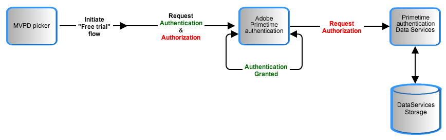

# 临时传递 {#temp-pass}

>[!NOTE]
>
>此页面上的内容仅供参考。 使用此API需要来自Adobe的当前许可证。 不允许未经授权使用。

## 功能摘要 {#tempass-featur-summary}

临时密码允许程序员为没有MVPD帐户凭据的用户提供对其受保护内容的临时访问权限。  临时传递包括以下功能：

* 临时密码可以配置为提供临时访问权限，以涵盖各种场景，包括：
   * 程序员可以每天提供其某个站点的简短信息（例如，10分钟的预览）。
   * 程序员可以就重大体育赛事（如奥运会或NCAA三月疯狂）提供单个长时间的演示（例如，四个小时）。
   * 程序员可以提供前两种情况的组合；例如，初始的较长的查看时段，一天后的一系列较短的查看时段，这些查看时段在随后的某天每天重复。
* 程序员指定其临时传递的持续时间（生存时间或TTL）。
* 临时传递针对每个请求者运行。  例如，NBC可以为请求者“NBCOlympics”设置4小时的临时传递。
* 程序员可以重置授予特定请求者的所有令牌。  用于实施Temp Pass的“临时MVPD”必须在启用“每个请求者的身份验证”的情况下进行配置。
* **临时传递访问权限授予特定设备上的单个用户**. 在某个用户的“临时传递”访问过期后，该用户将无法临时访问同一设备，直到该用户过期 [授权令牌](/help/authentication/glossary.md#authz-token) 是从Adobe Primetime身份验证服务器清除的。


>[!NOTE]
>
>临时传递是Premium工作流包的一部分。 如果想使用此功能，请联系您的Primetime销售代表。

## 功能详细信息 {#tempass-featur-details}

* **如何计算查看时间** - Temp Pass保持有效的时间与用户在程序员应用程序上查看内容所花费的时间无关。  在通过Temp Pass对授权发出初始用户请求时，通过将初始当前请求时间加到由程序员指定的TTL来计算到期时间。 此到期时间与用户的设备ID和程序员的请求者ID相关联，并存储在Primetime身份验证数据库中。 每次用户尝试使用来自同一设备的Temp Pass访问内容时，Primetime身份验证会将服务器请求时间与用户的设备ID和程序员的请求者ID关联的过期时间进行比较。 如果服务器请求时间小于过期时间，则将授予授权；否则，将拒绝授权。
* **配置参数**  — 以下Temp Pass参数可由程序员指定以创建Temp Pass规则：
   * **令牌TTL**  — 允许用户在未登录MVPD的情况下观看的时间。 此时间基于时钟，并且无论用户是否观看内容都会过期。
  >[!NOTE]
  >请求者ID不能有多个与其关联的临时传递规则。
* **身份验证/授权**  — 在Temp Pass流中，您将MVPD指定为“Temp Pass”。  Primetime身份验证不会与Temp Pass流中的实际MVPD通信，因此“Temp Pass”MVPD会授权任何资源。 程序员可以指定可使用Temp Pass访问的资源，就像对其网站上的其他资源执行操作一样。 媒体验证器库可以照常使用，以在播放之前验证Temp Pass短媒体令牌并强制执行资源检查。
* **在临时传递流中跟踪数据**  — 关于临时传递权利流期间跟踪数据的两点：
   * 从Primetime身份验证传递到 **sendTrackingData()** callback是设备ID的哈希值。
   * 由于临时传递流中使用的MVPD ID是“临时传递”，因此该MVPD ID将传递回 **sendTrackingData()**. 大多数程序员可能会希望以不同的方式处理临时传递量度与实际的MVPD量度。 这需要在您的Analytics实施中进行一些额外的工作。

下图显示了Temp Pass流程：



*图：温度传递流程*

## 实施临时传递 {#implement-tempass}

在Primetime身份验证方面，Temp Pass是通过向参与程序员的服务器配置添加名为“TempPass”的伪MVPD实现的。  此伪MVPD的作用类似于临时授予对程序员受保护内容的访问权限的实际MVPD。

在程序员方面，对于MVPD用于身份验证的两种方案，Temp Pass的实现方式如下：

* **程序员页面上的iFrame**. 无论MVPD的身份验证类型如何，Temp Pass都能正常工作，但对于iFrame方案，需要执行其他步骤来取消当前身份验证流程并使用Temp Pass进行身份验证。 这些步骤如所示 [iFrame登录](/help/authentication/temp-pass.md) 下。
* **重定向到MVPD登录页面**. 在更传统的情况下，即在开始使用MVPD进行身份验证之前提供用于触发Temp Pass的UI，无需采取任何特殊步骤。 临时传递应像常规MVPD一样处理。

以下几点适用于两种实施方案：

* 仅对于尚未请求临时传递授权的用户，“临时传递”应显示在MVPD选取器中。 通过在Cookie上保留标记，可以阻止显示后续请求。 只要用户不清除浏览器缓存，该操作就会运行。 如果用户清除其浏览器缓存，则选择器中将再次显示“Temp Pass”，用户将能够再次请求它。 仅当“临时通过”时间尚未过期时，才会授予访问权限。
* 当用户通过Temp Pass请求访问时，Primetime身份验证服务器不会在身份验证过程中执行其常规的安全声明标记语言(SAML)请求。 相反，身份验证端点将在令牌对设备有效期间每次调用它时返回成功结果。
* Temp Pass过期时，其用户将不再进行身份验证，因为在Temp Pass流中，身份验证令牌和授权令牌具有相同到期日期。 为了向用户说明其Temp Pass已过期，程序员必须在调用后立即检索选定的MVPD `setRequestor()`，然后调用 `checkAuthentication()` 一如往常。 在 `setAuthenticationStatus()` 回调可执行检查以确定身份验证状态是否为0，以便如果选定的MVPD为“TempPass”，则可以向用户显示其临时传递会话已过期的消息。
* 如果用户在Temp Pass令牌过期前将其删除，则后续权利检查将生成一个TTL等于剩余时间的令牌。
* 如果用户过期后删除Temp Pass令牌，则后续权利检查将返回“用户未授权”。

请参阅中的示例 [示例代码](/help/authentication/temp-pass.md#tempass-sample-code) 下面是如何对此部分中描述的实施详细信息进行编码的示例。

## 示例代码 {#tempass-sample-code}

以下部分介绍了如何调用Primetime身份验证API以实施Temp Pass流：

* [iFrame登录示例](/help/authentication/temp-pass.md#iframe-login-sample)
* [自动登录示例](/help/authentication/temp-pass.md#auto-login-sample)

### iFrame登录示例 {#iframe-login-sample}

此示例说明如何在MVPD支持iFrame集成的情况下实施临时传递：

```HTML
<!DOCTYPE HTML PUBLIC "-//W3C//DTD HTML 4.01 Transitional//EN"
        "http://www.w3.org/TR/html4/loose.dtd">
<html>
<head>
    <title>Temp Pass Sample</title>
    <script type="text/javascript" src="https://ajax.googleapis.com/ajax/libs/jquery/1.7.2/jquery.min.js"></script>
    <script type="text/javascript" src="https://raw.github.com/carhartl/jquery-cookie/master/jquery.cookie.js"></script>
    <script type="text/javascript" src="http://ajax.googleapis.com/ajax/libs/swfobject/2.2/swfobject.js"></script>
 
    <script type="text/javascript">
        var ae, ifrm, providersMenu, previousSelectedProvider;
        var tempassSelected = false;
 
        $(document).ready(function() {
            ifrm = $('#ifrm');
            swfobject.embedSWF("http://entitlement.auth.adobe.com/entitlement/AccessEnablerDebug.swf"
                    , "ae", "1", "1", "11.0.0", "expressinstall.swf", {}
                    , {wmode: "transparent", allowScriptAccess: "always"}
                    , {id: "accessEnabler", name: "accessEnabler"});
        });
 
        function swfLoaded() {
            ae = $('#accessEnabler')[0];
            ae.setProviderDialogURL("none");
            ae.setRequestor("sample_requestor_Id");
            previousSelectedProvider = ae.getSelectedProvider(); 
            ae.checkAuthentication();
        }
 
        function createIFrame() {
            providersMenu.hide();
 
            // If the user already used TempPass once, hide the button
            if ($.cookie("TPSelected") == "1"){
                $('#tempassBtn').hide();
            }
            ifrm.show();
        }
 
        function displayProviderDialog(providers) {
            if (tempassSelected) {
                // Remember in a cookie that the user selected temp pass
                $.cookie("TPSelected", "1", {expires: 366, path: '/'});
 
                // Authenticate with temp pass
                ae.setSelectedProvider("TempPass");
            } else {
                $('#loginBtn').hide();
                providersMenu = $('<select></select>');
 
                providersMenu.change(function(event){
                    ae.setSelectedProvider(event.target.value);
                });
 
                $.each(providers, function(k, v) {
                    // Add the MVPDs to the menu while making
                    //   sure that the Temp Pass entry is skipped
                    if(v.ID != "TempPass") {
                        providersMenu.append($('<option></option>', {value:v.ID}).text(v.displayName));                       
                    }
                });
                $('body').append(providersMenu);
            }
        }
 
        function setAuthenticationStatus(status, code) {
            loginBtn = $('#loginBtn');
            logoutBtn = $('#logoutBtn');
            console.log(previousSelectedProvider);
 
            if (status == 1) {
                $('#selectedProvider').text("Authenticated with " + ae.getSelectedProvider().MVPD + "   ");
                loginBtn.hide();
                logoutBtn.show();
 
                // Get authorization
                ae.getAuthorization("sample_requestor_Id");
            } else {
                // If selected provider is TempPass but the user is not authenticated,
                //   infer that the TempPass period has expired, so reset the MVPD selection
                if (previousSelectedProvider && previousSelectedProvider.MVPD == "TempPass") {
                    previousSelectedProvider = null;
                    ae.setSelectedProvider(null);
                    alert("Your Temp Pass has expired, please login with your regular cable provider!");
                }
                loginBtn.show();
                logoutBtn.hide();
            }
        }
 
        function selectTempPass() {
            ifrm.hide();
 
            // Signal the fact that the user selected temp pass
            tempassSelected = true;
 
            // Cancel the current authentication flow
            ae.setSelectedProvider(null);
 
            // Retry authentication
            ae.getAuthentication();
 
        }
    </script>
</head>
<body>
    <button id="loginBtn" style="display: none" onclick="ae.getAuthentication();">Login</button>
    <label id="selectedProvider" for="logoutBtn"></label><button id="logoutBtn"
           style="display: none" onclick="ae.logout()">Logout</button>
    <div id="ifrm"
         style="display: none; position: absolute; top: 50px; left:50px; width: 400px; height: 400px; border: 2px solid red;">
        <button id="tempassBtn"
           onclick="selectTempPass();"
             style="float:left">Don't know your credentials? Click here to get a Temp Pass.
        </button>
        <button onclick="window.location.reload()" style="float:right">X</button>
        <br />
        <hr />
        <iframe src="about:blank" id="mvpdframe" name="mvpdframe" width="90%" height="90%" frameborder="0"></iframe>
    </div>
    <br/>
    <div id="ae" style="display: none">
        <p>Loading Access Enabler...</p>
    </div>
</body>
</html>
```

#### iFrame登录用例 {#iframe-login-use-cases}

**要首次请求临时传递：**

1. 用户访问程序员页面并单击登录链接。
1. 此时将打开MVPD选取器，用户将从列表中选择MVPD。
1. 将显示身份验证iFrame。 此iFrame包含一个“临时通过”链接。
1. 用户单击“Temp Pass”，因此程序员会向Cookie添加一个标志，以防止用户随后访问页面时看到“Temp Pass”链接。
1. 临时传递身份验证请求到达Primetime身份验证服务器，它们会生成身份验证令牌。 TTL等于程序员为Temp Pass设置的时间段。
1. 临时传递授权请求到达Primetime身份验证服务器。
1. Primetime身份验证服务器从请求中提取设备和请求者ID，并将其与过期时间一起存储在数据库中。 过期时间的计算方式为：初始Temp Pass请求时间加上TTL（由程序员指定）。
1. Primetime身份验证服务器生成授权令牌。
1. 用户访问受保护的内容。

**要在回访的Temp Pass用户删除浏览器Cookie后再次请求Temp Pass：**

1. 用户访问程序员页面并单击登录链接。
1. 此时将打开MVPD选取器，用户将从列表中选择MVPD。
1. 将显示身份验证iFrame。 此iFrame包含一个“临时传递”链接（用户删除了原始Cookie，因此程序员不知道用户之前是否单击了“临时传递”链接）。
1. 用户再次单击“Temp Pass”，因此程序员会再次向Cookie添加标记，以防用户随后访问页面时看到“Temp Pass”链接。
1. 临时传递身份验证请求到达Primetime身份验证服务器，服务器将生成身份验证令牌。 TTL现在是Temp Pass的剩余时间（当前时间与与设备ID关联的到期时间之间的差值）。
1. 临时传递授权请求到达Primetime身份验证服务器。
1. Primetime身份验证服务器从请求中提取设备和请求者ID，并使用它们从Primetime身份验证数据库中检索过期时间。 将当前时间与到期时间进行比较。
1. 如果用户的Temp Pass未过期，则Primetime身份验证服务器将生成授权令牌。
1. 如果用户的Temp Pass尚未过期，用户将能够访问受保护的内容。

### 自动登录示例 {#auto-login-sample}

以下示例展示了用户访问站点时使用TempPass自动登录的情况。 用户可以随时选择使用常规MVPD登录，如果TempPass已过期，则会发出警告：

```HTML
<html>
<head>
    <title>Temp Pass Sample</title>
    <script type="text/javascript"
             src="https://ajax.googleapis.com/ajax/libs/jquery/1.7.2/jquery.min.js"></script>
    <script type="text/javascript"
             src="https://raw.github.com/carhartl/jquery-cookie/master/jquery.cookie.js"></script>
    <script type="text/javascript"
             src="http://ajax.googleapis.com/ajax/libs/swfobject/2.2/swfobject.js"></script>
 
    <script type="text/javascript">
        var REQUESTOR = "REF";
        var RESOURCE = "sample_requestor_Id";
        var selectedProvider = null;
        var mvpds;
        var hasTempPassMVPD = false;
 
        // Used to cache the mvpd picker
        var picker;
 
        $(document).ready(function() {
            swfobject.embedSWF("http://entitlement.auth.adobe.com/entitlement/AccessEnablerDebug.swf"
                    , "ae", "1", "1", "11.0.0", "expressinstall.swf", {}
                    , {allowScriptAccess: "always"}
                    , {id: "accessEnabler", name: "accessEnabler"});
        });
 
        function swfLoaded(){
            console.log("AccessEnabler loaded");
            ae = $('#accessEnabler')[0];
 
            // Make sure the default picker is disabled
            ae.setProviderDialogURL("none");
 
            ae.setRequestor(REQUESTOR);
            ae.checkAuthentication();
        }
 
        /**
         * Callback received as a result of setRequestor()
         *
         * @param xml object holding the configuration for the current REQUESTOR
         * including the MVPD list
         */
        function setConfig(config) {
            // Save the mvpd list
            var mvpdList = $.parseXML(config);
            mvpds = $(mvpdList).find('mvpd');
 
            // Create the picker only once and cache it
            if(!picker) {
                picker = $('<div id="mvpdPicker"/>');
 
                var providersMenu = $('<select id="mvpdList" multiple></select>');
 
                $.each(mvpds, function(k, v) {
                    var mvpdID = $(v).find("id").text();
                    var mvpdName = $(v).find("displayName").text();
 
                    // Add the mvpd's to the menu while making
                    //   sure that the Temp Pass entry is skipped
                    if (mvpdID != "TempPass") {
                        providersMenu.append($('<option></option>', {value:mvpdID}).text(mvpdName));
                    } else {
                        hasTempPassMVPD = true;
                    }
                });
                picker.append(providersMenu);
                picker.append($('<br/>'));
                picker.append($('<input type="button" onclick="login()" value="login" />'));
                picker.append($('<input type="button" onclick="cancelPicker()" value="cancel" />'));                  
            }
 
            if (!hasTempPassMVPD) {
                $('#selectedProvider').html("FATAL ERROR: TempPass is not integrated with '" +
                  REQUESTOR + "'<br />This sample is valid only for sites integrated with TempPass !!!");             
            }
        }
 
        /**
         * Callback triggered for iFramed MVPD's
         */
        function createIFrame() {
            $('#mvpdPicker').remove();
            $('#ifrm').show();
        }
 
        /**
         * Hides the MVPD picker
         * when the user clicks "Cancel"
         */
        function cancelPicker() {
            $('#video').show();
            $('#mvpdPicker').remove();
            $('#loginBtn').show();
        }
 
        /**
         * Pops up the MVPD picker
         */
        function showPicker() {
            $('#video').hide();
            $('#loginBtn').hide();
            $('body').append(picker);
        }
 
        function logout() {
            $.removeCookie('tempPassUsed');
            ae.logout();
        }
 
        /**
         * Performs login with the selected MVPD
         */
        function login() {
            selectedProvider = $('#mvpdList').val()[0];
 
            // Make sure we clear out previously
            // selected. This is a must if we want to force
            // login with a real MVPD while still logged in with
            // TempPass, without doing an ae.logout()
            ae.setSelectedProvider(null);
            ae.getAuthentication();
        }

        /**
         * Callback triggered by AccessEnabler. This is usually
         * triggered in order to display the MVPD picker, but
         * since we already constructed, cached, and displayed the
         * picker, and the user already picked the MVPD, we don't need
         * to do anything here but state management
         */
        function displayProviderDialog() {
            // If the selected MVPD is TempPass
            // store this fact in a cookie,
            // otherwise clear it
            if (selectedProvider != 'TempPass') {
                $.removeCookie('tempPassUsed');
            } else {
                $.cookie("tempPassUsed", 1);
            }
 
            // Since the picker was already shown
            // and the user picked an MVPD,
            // just proceed to login
            ae.setSelectedProvider(selectedProvider);
        }
 
        function setAuthenticationStatus(status, code) {
            if (!hasTempPassMVPD) {
                $('#selectedProvider').html("FATAL ERROR: TempPass is not integrated with '" +
                  REQUESTOR + "'<br />This sample is valid only for sites integrated with TempPass !!!");
            } else if(status == 1) {
                selectedProvider = ae.getSelectedProvider().MVPD;
                $('#selectedProvider').text("Authenticated with " + selectedProvider + "   ");
 
                // If authenticated with TempPass
                // allow the user to login with
                // a real MVPD
                if (selectedProvider == "TempPass") {
                    $('#loginBtn').show();
                    $('#logoutBtn').hide();
                } else {
                    $('#loginBtn').hide();
                    $('#logoutBtn').show();
                }
 
                // Get authorization
                // Note: This is mandatory in order to "start" the temp pass countdown
                ae.checkAuthorization(RESOURCE);
            } else if(code != "Provider not Selected Error") {
                // Auto-authenticate with TempPass only if we infer
                // that TempPass has not expired, otherwise we
                // inform the user that TempPass has expired
                if ($.cookie('tempPassUsed') == 1) {
                   $('#selectedProvider').text("Your Temp Pass has expired, please log in with your cable provider!");
                   $('#logoutBtn').show();
                   showPicker();
                } else {
                    selectedProvider = 'TempPass';
                    ae.getAuthentication();
                }
            }
        }
 
        /**
         * Displays the picker as a result
         * of user action
         */
        function loginClicked() {
            $('#loginBtn').hide();
            showPicker();
        }
 
        /**
         * Callback triggered in case of authorization success
         */
        function setToken(token) {
            console.log(token);
            $('#video').html('');
        }
 
        /**
         * Callback triggered in case of authz failure
         */
        function tokenRequestFailed(resource, status, message) {
            console.log(resource);
            $('#video').html('<p style="color: red">' + status + ': ' + message + '</p>');
        }
 
    </script>
</head>
<body>
    <button id="loginBtn" style="display: none" onclick="loginClicked()">Login</button>
    <label id="selectedProvider" for="logoutBtn"></label><button id="logoutBtn"
        style="display: none" onclick="logout()">Logout</button>
    <div id="ifrm"
         style="display: none; position: absolute; top: 50px; left:50px;
         width: 400px; height: 400px; border: 2px solid red;">
        <button onclick="window.location.reload()" style="float:right">Close this window</button>
        <br /><hr />
        <iframe src="about:blank" id="mvpdframe" name="mvpdframe" width="80%" height="80%" frameborder="0"></iframe>  
    </div>
    <br/>
 
    <div id="video"></div>
    <div id="ae" style="display: none"><p>Loading Access Enabler...</p></div>
</body>
</html>
```

## 使用多个临时刀路 {#use-mult-tempass}

某些事件需要分阶段自由访问内容，例如自由访问的初始时间间隔（例如，4小时），然后是每日自由访问（例如，每个后续日期的10分钟）。  为了使程序员实施此方案，他们必须与Adobe联系人一起安排此方案，以便为程序员配置两个临时MVPD。

对于此示例方案（初始4小时免费会话，随后每天10分钟免费会话），Adobe配置名为TempPass1的MVPD，其生存时间(TTL)为4小时，并配置名为TempPass2的TTL为10分钟的TempPass2，以用于后续时段。  两者都与程序员的请求者ID相关联。

### 程序员实施 {#mult-tempass-prog-impl}

在Adobe配置两个TempPass实例后，两个额外的MVPD（TempPass1和TempPass2）将显示在程序员的MVPD列表中。  程序员需要执行以下步骤来实施多个临时传递：

1. 用户首次访问网站时，会自动使用TempPass1登录。 您可以使用上面的自动登录示例作为此任务的起点。
1. 当您检测到TempPass1已过期时，请将该事实存储（在Cookie/本地存储中）并向用户展示您的标准MVPD选取器。 **确保从该列表中过滤掉TempPass1和TempPass2**.
1. 在接下来的每一天，如果TempPass1已过期，则使用TempPass2自动登录该用户。
1. TempPass2过期后，将当天的数据存储在Cookie/本地存储中，并向用户展示您的标准MVPD选取器。 请再次确保从该列表中过滤掉TempPass1和TempPass2。
1. 在每个新的日期00:00，使用 [重置TempPass Web API](/help/authentication/temp-pass.md#reset-all-tempass).

>[!NOTE]
>**编程说明：** Primetime身份验证没有内置机制可在10分钟后停止免费流式传输。  在TempPass2过期后，由程序员决定是否限制访问。 为实现此目的，程序员可以在他们的网站/应用程序中每X分钟实施一次“checkAuthorization”调用，其中X是程序员确定对其应用程序有意义的时间段。

## 重置所有临时传递 {#reset-all-tempass}

某些业务规则需要定期清除临时通行证，或临时重置为特定请求者ID和MVPD ID颁发的所有临时通行证。 此功能支持以下用例：

* 每日10分钟的临时通过（临时通过必须在一天开始时重置）
* 在突发新闻期间向所有用户提供Temp Pass。 （一旦突发新闻开始，需要立即为所有设备重置临时密码。）
* 多个“临时通过”方案提供一定长度的初始查看时段的组合，然后是另一个长度的后续每日时段。

为了重置所有临时传递，Primetime身份验证为程序员提供 *公共* Web API：

```url
DELETE https://mgmt.auth.adobe.com/reset-tempass/v2/reset
```

>[!NOTE]
>上述URL取代了以前的重置API。 旧重置API (v1)不再受支持。

* **协议：** HTTPS
* **主机：**
   * 发行版 — mgmt.auth.adobe.com
   * 先决条件 — mgmt-prequal.auth.adobe.com
* **路径：** /reset-tempass/v2/reset
* **查询参数：** `device_id=all&requestor_id=REQUESTOR_ID&mvpd_id=TEMPPASS_MVPD_ID`
* **标头：** ApiKey - 1232293681726481
* **响应：**
   * 成功 — HTTP 204
   * 失败：
      * 错误请求的HTTP 400
      * 如果未指定ApiKey，则返回HTTP 401
      * 如果ApiKey无效，则使用HTTP 403

例如：

```curl
$ curl -H "Authorization: Bearer <access_token_here>" -X DELETE -v "https://mgmt.auth.adobe.com/reset-tempass/v2.1/reset?device_id=all&requestor_id=AdobeBEAST&mvpd_id=TempPass"
```

## 支持的客户端 {#supp-clients}

平台支持Temp Pass and Reset Tool ：

| Adobe Primetime身份验证客户端 | 临时传递 | 重置工具 |
|:--------------------------------------:|:---------:|:----------:|
| js AccessEnabler | 是 | 是 |
| Native Client iOS | 是 | 是 |
| Native Client tvOS | 是 | 是 |
| Native Client Android | 是 | 是 |
| Native Client fireTV | 是 | 是 |
| 无客户端API | 是 | 是 |

## 限制和已知问题 {#limitations}

本节介绍适用于当前临时传递实施的限制。

**JavaScript SDK**：支持从版本重置临时传递功能 **3.X及更高版本**.

<!--For Customers migrating from the 2.X JavaScript AccessEnabler to the 3.X JavaScript AccessEnabler, see [AccessEnabler JS 2.x to JS 3.x migration guide](https://tve.helpdocsonline.com/accessenabler-js-to-js-migration-guide).-->
