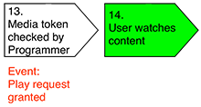

# 了解服务器端量度 {#understanding-server-side-metrics}

>[!NOTE]
>
>此页面上的内容仅供参考。 使用此API需要来自Adobe的当前许可证。 不允许未经授权使用。

## 介绍 {#intro}

本文档介绍了授权服务监控(ESM)服务生成的Adobe Primetime身份验证服务器端量度。 它描述的事件与从客户端角度看到的事件不同(如果程序员要在其页面/应用程序上实施Adobe Analytics等测量服务，他们会看到什么)。

## 事件摘要 {#events_summary}

从Adobe Primetime身份验证服务器端角度来看，生成以下事件：

* **身份验证流程中生成的事件**（使用MVPD的实际登录）

   * 身份验证尝试通知 — 此消息在用户发送到MVPD登录站点时生成。
   * AuthN挂起的通知 — 如果用户使用其MVPD成功登录，则在用户重定向回Primetime身份验证时生成此信息。
   * 授权通知 — 当用户返回程序员网站并且已成功从Primetime身份验证中检索身份验证令牌时，将生成此项。
* **授权流程** （只需检查MVPD的授权）\
  *先决条件：* 有效的身份验证令牌
   * AuthZ尝试通知
   * 已授予AuthZ的通知
* **播放请求成功**\
  *先决条件：* 有效的AuthN和AuthZ令牌
   * 使用Adobe Primetime身份验证进行检查的通知
   * 播放请求需要同时获得授权的身份验证和授权

中详细介绍了独特用户的数量 [独特用户](#unique-users) 部分。 作为概述，由于授予的身份验证和授权响应通常会缓存，因此通常应用以下公式：

* AuthN尝试次数\>授予的AuthN次数
* AuthZ尝试次数\>授予的AuthZ次数
* AuthZ尝试次数\>授予的AuthN次数（通常为）
* 成功的播放请求数\>已授予的身份验证数量

### 示例 {#example}

以下示例显示了一个品牌一个月内的服务器端量度：

| 量度 | MVPD 1 | MVPD 2 | … | MVPD n | 总计 |
| -------------------------- | ------ | ------ | - | ------ | ---------------------------------------------- |
| 成功的身份验证 | 1125 | 2892 |   | 2203 | SUM(MVP1+...MVPD n) |
| 成功的授权 | 2527 | 5603 |   | 5904 | SUM(MVP1+...MVPD n) |
| 成功的播放请求 | 4201 | 10518 |   | 10737 | SUM(MVP1+...MVPD n) |
| 独特用户 | 1375 | 2400 |   | 2890 | 所有MVPD的所有用户总和已消除重复\* |
| 尝试的身份验证 | 2147 | 3887 |   | 3108 | SUM(MVP1+...MVPD n) |
| 已尝试的授权 | 2889 | 6139 |   | 6039 | SUM(MVP1+...MVPD n) |

 

在这种情况下，重复数据消除应该不会产生任何影响，因为不同的MVPD用户应该不会收到相同的用户ID。 当对两个不同品牌但相同的MVPD执行加总操作时，重复数据消除效果应该要大得多。

## 事件触发器 {#event_triggers}

### 新用户 — 完整流量 {#new-user-full-flow}

下表描述了无身份验证令牌的用户（新用户或身份验证令牌已过期的用户）的事件和步骤：

该流程包括往返到MVPD的身份验证(#5为\#7)和授权(\#11)。

完成该流程后，身份验证和授权令牌将缓存在用户设备上。 身份验证令牌的生存时间(TTL)值介于6小时和90天之间。 AuthN令牌过期会自动强制AuthZ令牌过期。 授权令牌的TTL值通常为24小时。

| 已触发服务器端事件 | <ul><li>身份验证尝试、身份验证挂起、已授予身份验证</li><li>授权尝试，已授予授权</li><li>播放请求成功</li></ul> |
|---|---|

### 返回用户 — 已缓存AuthZ和AuthN令牌

对于缓存了有效AuthZ和AuthN令牌的用户，将执行以下步骤：

调用时自动触发 `getAuthorization()`，并且只涉及使用Adobe Primetime身份验证进行的检查。 MVPD不参与此流。

| 已触发服务器端事件 | *播放请求成功 |
|---|---|

### 返回用户 — 已缓存AuthN令牌，AuthZ令牌已过期

对于仍具有有效AuthN令牌的用户，将执行以下步骤：

此流涉及到MVPD的往返过程。

| 已触发服务器端事件 | <ul><li>授权尝试，授权正常</li><li>播放请求成功</li> |
|---|---|

## 身份验证事件 {#authn_events}

### 身份验证尝试 {#authentication-attempt}

如上图所示，仅当用户对MVPD进行往返时才会触发身份验证事件；身份验证事件不包括缓存的令牌身份验证。

在用户从选取器单击特定MVPD后，将触发身份验证尝试事件。

* MVPD端第一个接近此的事件是页面加载
* Adobe Primetime身份验证不计算用户登录MVPD页面的重复尝试次数（密码不正确，请重试）
* 多次尝试均计为一次尝试
* 某些MVPD也会在身份验证步骤中执行授权，如果授权失败，则不会将用户重定向回。

### 身份验证挂起 {#authentication-pending}

当到Adobe Primetime身份验证的重定向过程启动时，会发生此事件。

### 已授予身份验证 {#authentication-granted}

用户是MVPD的已知订户，通常具有付费电视订阅，但有时仅具有互联网访问。 发生成功的身份验证可能是因为用户使用其MVPD明确输入了有效凭据，或者是因为他们之前输入了有效凭据并选中了“记住我”（且上一个会话未过期）。

因此，MVPD会向Adobe Primetime身份验证发送对身份验证请求的肯定响应，并且Adobe Primetime身份验证会创建 *身份验证令牌*.

* 身份验证通常会缓存很长时间（一个月或更长时间）。 因此，在令牌过期并再次启动流之前，身份验证事件将不再存在。
* 通过单点登录从其他网站/应用程序传入将不会触发身份验证事件。

### Comcast身份验证 {#comcast-authentication}

与其他MVPD相比，Comcast具有不同的AuthN流。

以下功能描述了这些差异：

* **会话Cookie行为**：这会导致在用户关闭浏览器后完全删除任何身份验证令牌。 此功能仅存在于Web上。 主要目的是确保您的Comcast会话不会在不安全的/共享计算机上持续存在。 其影响是，与其他MVPD相比，将存在更多的身份验证尝试/授予的流。

* **每个请求者ID的AuthN**：Comcast不允许将AuthN状态从一个请求者ID缓存到另一个请求者ID。 因此，每个网站/应用程序都必须转到Comcast以获取身份验证令牌。 除了用户体验注意事项之外，其影响如上所示，是将会生成更多身份验证尝试/授予的事件。

* **被动身份验证**：为了改进用户体验但仍保持每个请求者ID的AuthN功能，会在隐藏iFrame中进行被动身份验证流程。 用户看不到任何内容，但事件仍会像之前一样触发。

如果用户在Comcast登录页面上单击“记住我”，则对此页面的后续访问（在2周内）将只是快速重定向回来。 否则，用户实际上必须在页面上执行身份验证。

### 身份验证失败 {#unsuccessful-authentication}

在Adobe Primetime身份验证中，身份验证失败本身并不是事件，而是尝试与成功之间的差异。

在2013年5月版中，Adobe Primetime身份验证将为由于系统或网络错误(包括DRM错误（令牌绑定失败）和LSO错误（没有写入令牌的空间等）导致的身份验证失败添加错误代码。

### 身份验证转换率 {#authenitication-conversion-rate}

程序员可以跟踪的一个有趣量度是身份验证转化率，计算为（AuthN请求/已授予AuthN）%。

有关量度的某些说明：

* 由于它是一个基于事件的量度，因此不会真正反映独特用户转化率 — 如果用户尝试八次并第九次成功 — 这会在上面的转化率中严重反映。
* 在Adobe Primetime身份验证（服务器端）中，尚无法计算基于唯一身份验证的转换。
* 如果网站/应用程序中存在自动身份验证重试，这也会扭曲上述量度。

## 授权事件 {#authorization_events}

### 授权尝试 {#authorization_attempt}

除了获取身份验证令牌之外，用户还必须获取授权令牌才能播放内容。 这通常发生在身份验证之后，或者授权令牌过期之后。 由于此检查在服务器端(从Adobe Primetime身份验证服务器到MVPD服务器)完成，因此用户无需执行任何操作。

### 已授予授权 {#authorization-granted}

“被授予的授权”表示经验证用户的订阅包括所请求的节目。

请注意，并非所有MVPD都支持单独的授权步骤；对于某些身份验证，其权限等于授权。 MVPD将Adobe Primetime身份验证成功响应发送到后通道AuthZ请求，并且Adobe Primetime身份验证创建AuthZ令牌。

* AuthZ令牌会缓存一段时间，通常为24小时。在此期间，不会触发任何AuthZ事件。
* 有些MVPD使用资产级别授权，而另一些则使用渠道级别授权； — 根据使用的授权而定，会触发更多或更少的AuthZ事件。 即使对于渠道级别的授权，缓存也已经存在 — 因此，如果在不到24小时内请求了同一资产，则不会触发任何事件。

### 授权被拒绝 {#authorization-denied}

如果授权被拒绝，则经验证的用户没有对所请求的编程的确认订阅。 最可能的原因是频道不是用户订阅包的一部分，但这也可能反映用户仅可从MVPD访问Internet。

对于某些MVPD，即使用户只有MVPD的Internet订阅（无付费电视订阅），也可以成功进行身份验证。 在这种情况下，即使用户请求授权的渠道位于基础包中，授权也会被拒绝。

某些MVPD为AuthZ拒绝提供了自定义错误消息，其中可能包含升级其包的选件。

### 授权转换率 {#authorization-conversion-rate}

身份验证转换率可计算为（AuthZ请求/授予的AuthZ）%。

### 播放请求成功 {#successful-play-request}

允许经过身份验证和授权的用户查看受保护的内容。

在播放请求成功后，Adobe Primetime身份验证会生成一个生命周期短的媒体令牌，声明用户有权查看请求的视频。 程序员使用此媒体令牌进一步验证潜在查看者。 媒体令牌将作为成功的播放请求进行跟踪。

* Adobe Primetime身份验证 *非* 跟踪视频播放是否在生成媒体令牌后实际开始。 例如，如果内容存在地域限制，即使流从未实际开始，该交易仍会计为成功的播放请求。
* 由于AuthN和AuthZ令牌会缓存MVPD响应一段时间，因此成功的播放请求事件是量度中最频繁的事件。

## 独特用户 {#unique-users}

### 定义 {#definition}

在成功进行身份验证后，Adobe Primetime身份验证会根据返回的MVPD用户ID值跟踪唯一用户的存在。  此值基于用户的登录信息，但不包含任何可识别个人身份的信息。

此值也会在sendTrackingData回调中传递到站点/应用程序。

该值可以跨设备持久（MVPD为给定用户生成相同的值，无论登录发生在何处）或瞬时(对于每个登录，都会生成一个新值，MVPD将映射到该值的后端。 通常，MVPD提供给Adobe Primetime身份验证的值跨会话和设备进行持久性，但如前所述，持久性既不得到保证，也不得到验证。

此值用作计算独特用户的方法。 所报告的值（每个请求者ID/时间间隔/MVPD）将在特定时间间隔内消除重复项。 因此，每天独特用户数的总和通常与每月值不同，而每月值的值较低。

此数字包括来自Adobe Primetime身份验证的所有事件，减去身份验证尝试（没有用户ID），但包括已尝试（可能失败）的授权。

### 示例 {#examples}

#### 第1天 {#day1}

用户XYZ前往站点观看视频。

触发的事件：

* 身份验证尝试（尚无唯一用户）
* 已授予AuthN
   * 此时，我们根据MVPD返回的内容来唯一标识用户，因此每日独特用户计数将增加1
   * authN令牌缓存了30天
* AuthZ尝试/授予的事件
   * AuthZ令牌缓存了1天
* 播放请求事件成功

#### 第1天（稍后） {#day1-later-on}

用户XYZ观看另一段视频。

触发的事件：

* 播放请求事件成功（其余内容已缓存）
* 每日或每月独特值没有增加

#### 第3天 {#day3}

用户XYZ观看另一段视频。

触发的事件：

* AuthZ尝试/授予的事件
   * 自第1天起的1天缓存过期后
* 播放请求事件成功（其余内容已缓存）
* 每日独特用户数增加1 — 每月独特用户数仍为1

#### 第31天 {#day31}

用户XYZ观看另一段视频。

与AuthN缓存过期的第1天相同。

如果同一用户授权失败，则每月独特用户数仍会增加1，因为有两个事件包含用户ID：已授予身份验证和授权尝试。

### 单点登录(SSO) {#single-sign-on-sso}

在某些情况下，独特用户的数量可能大于成功身份验证的数量。 当许多用户通过SSO从其他网站/应用程序进入，并且只需在当前网站/应用程序上获得授权时，通常会出现这种情况。

### 比较客户端和服务器端独特用户 {#comparing-client-side-and-server-side-unique-users}

如果用户标识值来自 `sendTrackingData()` 用于在客户端计算独特用户，则客户端和服务器端编号应匹配。

如果差异是主要的，则通常由以下原因来解释差异：

* 视频播放独特性相对于所有事件独特性。 如前所述，Adobe Primetime身份验证计算所有事件的独特用户数，但身份验证尝试除外。 这意味着如果用户仅进行身份验证（在页面上）但未查看视频，则仍会触发独特用户计数增加。

* 计数授权失败的用户 — Adobe Primetime身份验证计算这些用户以及报告的数量。

<!--
## Related Information {#related-information}

- [Entitlement Service Monitoring API](/help/authentication/entitlement-service-monitoring-api.md)

-->
