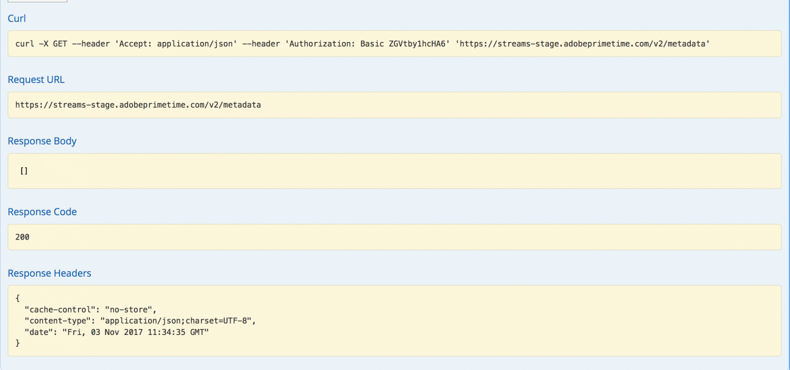
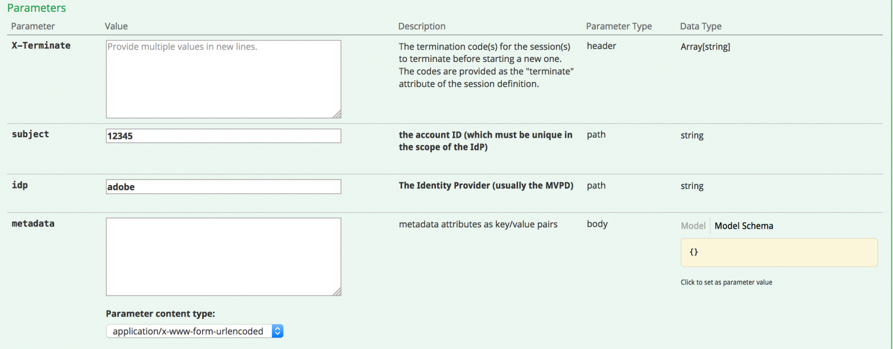
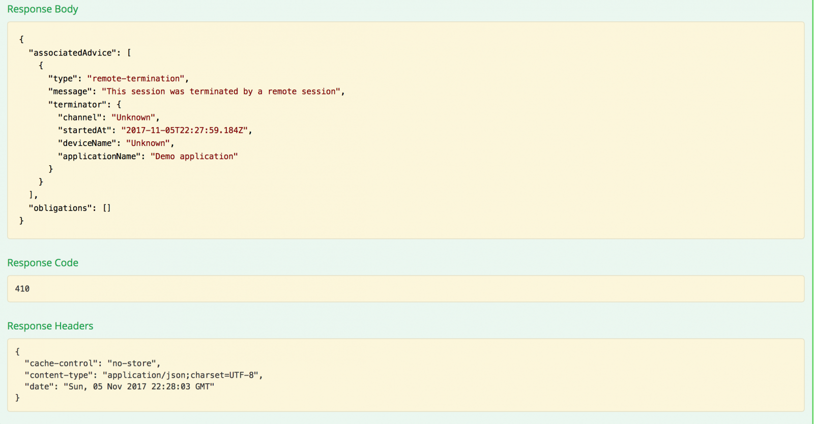

# API概述 {#api-overview}

查看 [在线API文档](http://docs.adobeptime.io/cm-api-v2/) 以了解更多详细信息。

## 目的和先决条件 {#purpose-prerequisites}

当实施与并发监控的集成时，本文档可帮助应用程序开发人员使用我们的Swagger API规范。 强烈建议读者先了解服务定义的概念，然后再遵循本准则。 要理解这一点，有必要概述 [产品文档](/help/concurrency-monitoring/cm-home.md) 和 [Swagger API规范](http://docs.adobeptime.io/cm-api-v2/).

## 介绍 {#api-overview-intro}

在开发过程中，Swagger公共文档体现了了解和测试API流的参考准则。 这是一个绝佳的起点，以便能够有一个实际操作方法，并熟悉现实世界应用程序在不同用户交互场景中的行为方式。

在中提交票证 [Zendesk](mailto:tve-support@adobe.com) 在并发监控中注册贵公司和应用程序。 Adobe将为每个实体分配一个应用程序ID。 在本指南中，我们将使用两个带有ID的参考应用程序 **demo-app** 和 **demo-app-2** 将位于租户Adobe下。

## 用例 {#api-use-case}

使用Swagger测试流的第一步是在页面的右上角输入应用程序ID，如下所示：

之后，我们按 **浏览** ，以便为对REST API进行的所有调用设置将在授权标头中使用的ID。  每个API调用都需要通过HTTP基本身份验证传入应用程序ID。 用户名是应用程序ID，密码为空。

### 第一个应用程序 {#first-app-use-cases}

具有ID的应用程序 **demo-app** 已由Adobe团队分配一项策略，其中一项规则将并发流数量限制为3。 策略会根据在Zendesk中提交的请求分配给特定应用程序。

#### 正在检索元数据 {#retrieve-metadata-use-case}

我们进行的第一个调用是针对元数据资源，以获取在会话初始化期间需要作为表单数据传递的元数据属性列表。 此元数据将用于评估为此应用程序分配的策略。

按“Try it out”后，对于具有ID的应用程序 **demo-app** 我们会得到以下结果：

正如我们从响应正文字段中看到的那样，元数据属性列表为空。 这意味着设计所需的属性足以评估分配给此应用程序的3个流策略。 另请参阅 [标准元数据字段文档](/help/concurrency-monitoring/standard-metadata-attributes.md). 调用后，我们可以继续并在Sessions REST资源上创建新会话。

#### 会话初始化 {#session-initial}

会话初始化调用是在获得执行会话初始化调用所需的所有必要信息后由应用程序完成的。

无需在首次调用时提供任何终止代码，因为我们没有任何其他活动的流。 没有元数据属性，因为检索元数据调用未返回任何属性。

此 **主题** 和 **idp** 参数是必需的，它们将指定为URI路径变量。 您可以获取 **主题** 和 **idp** 参数，方法是调用 **mvpd** 和 **上游用户ID** Adobe Primetime身份验证中的元数据字段。 另请参阅 [元数据API](https://experienceleague.adobe.com/docs/primetime/authentication/auth-features/user-metadat/user-metadata-feature.html?lang=en#). 在本例中，我们将提供值“12345”作为主题，“adobe”作为idp。

进行会话初始化调用。 您将收到以下响应：

我们需要的所有数据都包含在响应标头中。 此 **位置** 标头表示新创建的会话的id，以及 **日期** 和 **过期** 标头表示用于安排应用程序进行下一个心跳以保持会话活动的值。

#### 心率 {#heartbeat}

进行心跳调用。 提供 **session id** 获取自会话初始化调用以及 **主题** 和 **idp** 使用的参数。

如果会话仍然有效（未过期或已手动删除），您将收到一个成功的结果：

与第一种情况一样，我们将使用 **日期** 和 **过期** 标头，用于为此特定会话安排另一个心率。 如果会话不再有效，此调用将失败，并显示410 GONE HTTP状态代码。

您可以使用Swagger UI中的“保持流有效”选项在特定会话上执行自动心率，这可以帮助您测试规则，而无需担心执行及时会话心率所需的模板。 此按钮放置在Swagger心率选项卡中的“试用”按钮旁边。 要为创建的所有会话设置自动心率，您需要让这些会话在Web浏览器选项卡中打开的独立Swagger UI中计划每个会话。

#### 会话终止 {#session-termination}

您公司的业务案例可能要求并发监控终止特定会话，例如，当用户停止观看视频时。 可以通过在会话资源上进行DELETE调用来完成此操作。

对调用使用和会话心跳相同的参数。 响应HTTP状态代码为：

* 202成功响应被接受
* 如果会话已停止，则返回410。

#### 破坏策略 {#breaking-policy-app-first}

为了模拟我们的应用程序在分配给它的3个流策略被破坏时的行为，我们需要3次调用会话初始化。 要使策略生效，由于缺少心率，调用需要在一个会话过期之前完成。 我们将看到这些调用均成功，但如果我们进行第4次调用，则会失败，并出现以下错误：

我们在有效负荷中获取一个409 CONFLICT响应以及一个求值结果对象。 有关评估结果的完整说明，请参阅 [Swagger API规范](http://docs.adobeptime.io/cm-api-v2/#evaluation-result).

应用程序可以使用评估结果中的信息在停止视频时向用户显示特定消息，并在需要时采取进一步的操作。 一个用例可以是停止其他现有流以启动新流。 这是通过使用 **终止代码** 值存在于 **冲突** 特定冲突属性的字段。 该值将作为新会话初始化调用中的X-Terminate HTTP标头提供。

当在会话初始化时提供一个或多个终止代码时，呼叫将成功，并会生成一个新会话。 然后，如果我们尝试对某个已远程停止的会话发出心率，则会收到410 GONE响应，其中包含描述该会话已远程终止的评估结果有效负载，如示例所示：

### 第二个应用程序 {#second-application}

我们将使用的另一个示例应用程序是id应用程序 **demo-app-2**. 已为此策略分配了一个规则，该规则将通道可用的流数量限制为最多2个。   必须提供渠道变量才能对此策略进行评估。

#### 正在检索元数据 {#retrieving-metadata}

在页面的右上角设置新应用程序ID，并调用元数据资源。 您将收到以下响应：

此时，响应正文不再是一个空列表，如第一个应用程序的示例中所示。 现在，并发监控服务在响应机构中声明 **渠道** 会话初始化时需要元数据才能评估策略。

如果您没有为 **渠道** 参数，您将获得：

* 响应代码 — 400错误请求
* 响应正文 — 在中描述的评估结果有效负荷 **义务** 字段为会话初始化请求中期望的操作成功执行的操作。

#### 会话初始化 {#session-init}

为所需的元数据键分配一个值，并将其设置为会话初始化请求中的表单参数，如下所示：

现在，调用将成功，并生成一个新会话。

#### 破坏策略 {#breaking-policy-second-app}

为了打破分配给此应用程序的策略中的规则，我们需要使用相同的渠道值进行2次调用。 与第一个示例一样，在生成的第一个会话仍然有效时，需要完成第二个调用。

如果我们每次创建新会话时都对渠道元数据使用不同的值，则所有调用都将成功，因为阈值2单独限定于每个值的范围。

就像在第一个示例中一样，我们可以使用终止代码来远程停止冲突的流，或者我们可以等待其中一个流过期，假设不会对其运行任何心跳。

