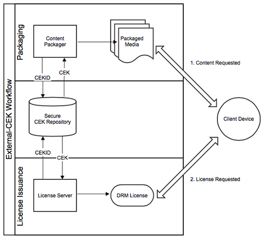

# AAXS DRM外部CEK工作流{#aaxs-drm-external-cek-workflow}

此工作流程与大多数现有DRM系统相去甚远，因为它不需要使用任何中央存储库或内容密钥管理系统(CKMS)。 但是，对于希望AAXS与其现有CKMS协作的客户，AAXS提供一种称为“外部CEK”的功能，在该功能中，CEK在包装和许可证发放时从外部提供。

1. （包）AAXS Java SDK提供有CEK和CEK ID。
1. （包）CEK用于加密内容。
1. （包）CEK ID将插入内容的DRM元数据中。
1. 设备尝试通过从AAXS服务器请求许可证来播放内容。
1. （许可）AAXS服务器从内容元数据中提取CEK ID。
1. AAXS服务器从CKMS中检索CEK。
1. （许可）AAXS服务器向设备颁发包含CEK的许可证。
