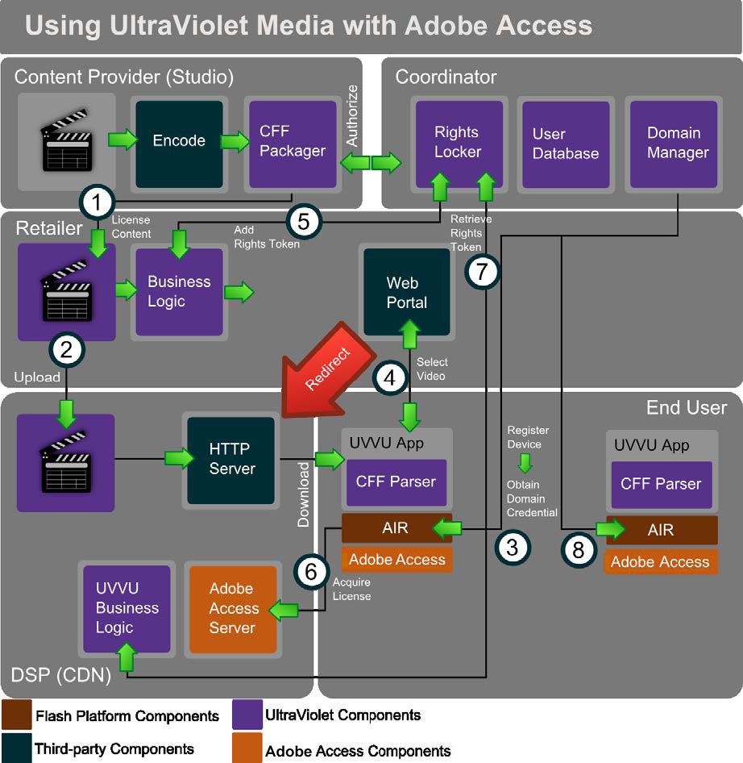

# UltraViolet媒体和Adobe访问{#ultraviolet-media-and-adobe-access}

Adobe Access可以与其他第三方内容流解决方案一起使用，以建立一个完整、安全的基于DRM的媒体分发生态系统。

UltraViolet()是一种数字版权认证和基于云的分发系统，使数字家庭娱乐内容的消费者能够通过多个平台和设备流式传输和下载购买的内容。 UltraViolet内容将使用通用加密(CENC)以通用文件格式(CFF)下载（或流式传输）。

很容易设置UltraViolet系统和Adobe访问。 以下用例描述了内容流行为：

<!---->

1. 内容所有者以CFF对内容进行编码和打包。 打包内容可授权给零售商进行分发。
1. 零售商将内容上传到数字服务提供商，如CDN。 内容现在可供下载。 请注意，其中某些角色可以由一个或多个公司扮演。

   最终用户有支持Adobe AIR的设备。 除此之外，用户还需要安装符合UltraViolet规范的应用程序。 应用程序包含解析CFF并供运行时使用的必要代码。 所有敏感加密操作都在安全运行时中处理。
1. 应用程序可以触发与协调器交互的设备的域连接。 协调员维护一个权限柜、一个用户数据库和域。 协调者的域管理器是使用Adobe Access SDK构建的，用于实施特定于Adobe Access的域加入/离开操作。
1. 然后，用户可以使用应用程序选择要从零售商处获取的视频。 零售商通常提供一个Web门户，并处理所有业务逻辑。
1. 然后，零售商与协调员交互以添加权利令牌。 然后，零售商会将请求重定向到服务提供商，以便下载实际内容。
1. 如果设备尚未获得内容的许可证，它会使用CFF触发许可证请求。 该请求通常包括域证书、用户凭据和有关应用程序的信息。 该服务提供商运行一个Adobe访问许可证服务器(使用Adobe访问SDK开发)，它遵循UltraViolet规范。
1. 服务提供商的UltraViolet业务逻辑根据需要与协调人交互，以检索适当的权利令牌，以确定是否应发放内容许可。

   内容许可证已绑定到域。 客户端应用程序可以将许可证插入到CFF文件中。 现在可以在应用程序中播放内容，所有保护和使用规则强制执行都由运行时中的“Adobe访问”组件处理。
1. 同一最终用户拥有的其他设备和应用程序可以向协调器注册。 现在，无需任何外部事务即可将内容加载到其他Adobe Access设备中。

