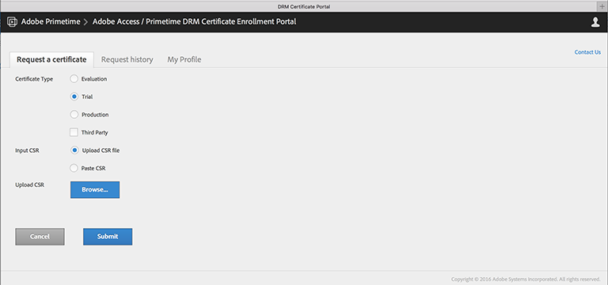

# 设置（帐户等） {#get-provisioned-accounts-etc}

要开始使用由ExpressPlay提供支持的Primetime DRM Cloud，您需要在Adobe代表的帮助下设置Adobe Cert和ExpressPlay帐户。

1. 与Adobe代表联系并请求您使用TVSDK实施多DRM所需的Adobe Cert和ExpressPlay帐户。

       向Adobe代表提供您将用作联系点的电子邮件地址。 然后，Adobe会为您创建两个帐户：
   
   * ***证书门户帐户*** -(https://certportal.primetime.adobe.com): *Adobe Access / Primetime DRM证书登记管理团队向您提供的地址发送电子邮件* 。 该电子邮件包含Adobe证书门户的URL，以及指向Adobe证书注册文档的链接(此处是最新文档：证书 [登记指南](../../../digital-rights-management/certificate-enrollment-guide/about-certs.md))。

   * ***ExpressPlay帐户*** - Adobe会向您发送一封电子邮件，其中包含用于注册ExpressPlay管理员帐户的链接。

1. 使用您的Adobe ID登录Adobe证书门户（使用您向Adobe代表提供的相同电子邮件地址）。 如果您还没有Adobe ID，可以通过从证书门户访问“获取 *Adobe ID* ”链接快速创建一个：

   <!---->

   

1. 在Adobe证书门户上，请求试用 *证书* 。

   对于多DRM试用版，单个试用证书将涵盖内容保护的所有这些方面：包装、许可和传输。 您需要提供自己的 [CSR](../../../digital-rights-management/certificate-enrollment-guide/request-certs/gen-cert-signing-req.md) ，才能申请证书：
   <!---->

   

   Adobe将向您发送一封电子邮件，指示您是否接受或拒绝您的证书请求。 您可以在证书门户的“请求历史记录”选项卡上查看证 *书请求的状* 态：
   <!---->

   

1. 创建您的ExpressPlay管理员帐户。

   按照Adobe提供给您的ExpressPlay链接进行操作。 这将在ExpressPlay *中打开“创建帐户* ”页面。 填写所需信息并提交表单。 您将收到一封来自的电子邮件， `operations@expressplay.com` 其中包含一个为期一周的激活链接。 激活后，请设置ExpressPlay服务：
   <!---->

   

   创建服务后，您会收到自己的管理页面。 除了某些活动跟踪字段外，您还将看到您的“生产”和“测试” *客户身份验证器* （API密钥）以及您的“生产”和“测试”服务URL:

   <!---->

    

1. 如果您使用FairPlay，则需要执行其他步骤（在Apple开发人员站点上）来设置ExpressPlay。 有关 [说明，请参阅为FairPlay启用ExpressPlay服务](../../multi-drm-workflows/p-l-and-p/fairplay-workflow.md#enable-expressplay-service-for-fairplay) 。
