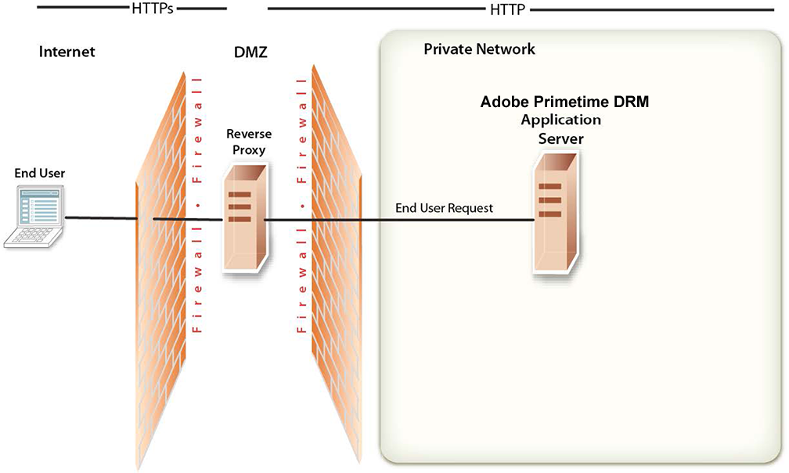

# 概述{#network-topology-overview}

成功部署Adobe PrimetimeDRM后，您必须保持Primetime DRM制作服务器的安全性。

>[!NOTE]
>
>Primetime DRM之前被称为Adobe访问，在此之前称为Flash Access。

您可以使用&#x200B;*反向代理*&#x200B;确保外部和内部用户可以使用Primetime DRM Web应用程序的不同URL集。 *反向* 代理比允许用户直接连接到运行Primetime DRM的应用程序服务器更安全，此配置为运行Primetime DRM的应用程序服务器执行所有HTTP请求。用户只能访问反向代理，并且只能尝试反向代理支持的URL连接。

<!---->

