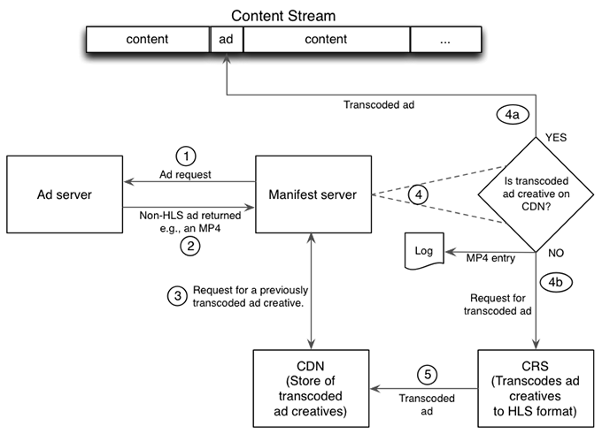

# JIT重新打包的详细工作流程 {#detailed-workflows-for-jit-repackaging}

客户端视频播放器或清单服务器都可以与CRS交互以实现JIT重新打包。 两者使用相同的广告选择逻辑。

## 清单服务器启动的JIT重新打包 {#section_1F1C1B7DD146403890C2B43E24FEF0EB}

清单服务器端的JIT重新打包工作流如下：

1. 清单服务器向广告服务器发出请求。
1. 清单服务器接收不是HLS格式的广告创意。
1. 清单服务器向CDN服务器发送请求，以获取广告创意的先前转码的HLS版本。

   >[!NOTE]
   >
   >在多CDN设置中，清单服务器使用 `ptcdn` 参数，用于标识CDN服务器。

1. 清单服务器检查响应：

   1. 如果请求成功，则清单服务器会将先前转码的HLS版本的广告创意插入到内容流中。
   1. 如果请求失败，清单服务器会生成一个日志条目，并向CRS请求转码版本。

1. CRS会对广告创意进行转码，并将HLS版本上传到CDN服务器以供将来使用。

对于该创意的所有后续请求，清单服务器从CDN中检索HLS版本并将其插入到内容流中。

## 客户端启动的JIT重新打包 {#section_FBC97D40043F4FDD98247A08BB6195B0}

<!---->

基于TVSDK或具有类似功能的客户端可以与CRS交互以实现JIT重新打包，如下所示：

1. 客户端向广告服务器请求广告。
1. 广告服务器将广告返回到客户端。
1. 客户端检查来自广告服务器的广告格式：

   1. 如果广告创意采用HLS格式，则客户端会将其插入（拼合）到内容中，并且此操作完成。
   1. 如果广告创意不是HLS格式，则客户端会向CDN服务器请求一个。

      >[!NOTE]
      >
      >在多CDN设置中，清单服务器使用 `ptcdn` 参数，用于标识CDN服务器。

1. 客户端检查来自CDN服务器的响应。

   1. 如果CDN提供了HLS版本，则客户端会将该版本插入（拼合）到内容中，并完成。
   1. 如果CDN服务器不提供HLS版本，则客户端会要求广告服务器向CRS请求版本。 客户端未将广告插入到内容中。

1. 广告服务器请求将非HLS转码为HLS。
1. CRS会创建HLS版本，并将其上传到CDN服务器以供将来使用。

## 广告格式优先级和时间线 {#section_A74DE37A57BF45D7B6D09E3DE40F8E61}

清单服务器和客户端使用相同的选择逻辑来确定播放可用广告的优先级。 首先是HLS格式的广告，然后是MP4、FLV，最后是WebM。

CRS通常需要2-4分钟来处理非HLS广告创意，通常少于3分钟。

CRS产生不同的HLS比特率，因此广告可以适合可用连接速度和带宽的速度播放。 如果有多个可用比特率，则CRS选择最高可用比特率。 如果CRS收到非HLS广告创意，则会以可用的最高分辨率生成HLS版本。