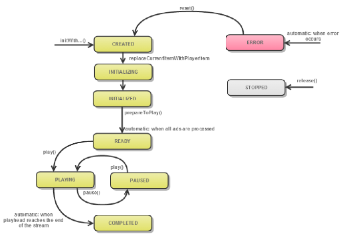

# 使用MediaPlayer对象{#work-with-mediaplayer-objects}

PTMediaPlayer对象表示您的媒体播放器。 PTMediaPlayerItem表示播放器上的音频或视频。

## 关于MediaPlayerItem类 {#section_B6F36C0462644F5C932C8AA2F6827071}

成功加载媒体资源后，TVSDK将创建一个实例 `PTMediaPlayerItem` 类来提供对该资源的访问权限。

此 `PTMediaPlayer` 解析媒体资源，加载关联的清单文件，并解析清单。 这是资源加载过程的异步部分。 此 `PTMediaPlayerItem` 实例在资源解析后生成，并且该实例是媒体资源的解析版本。 TVSDK提供对新创建的的访问权限 `PTMediaPlayerItem` 实例到 `PTMediaPlayer.currentItem`.

>[!TIP]
>
>在访问媒体播放器项目之前，必须等待资源成功加载。

## MediaPlayer对象生命周期 {#section_D87EF7FBC7B442BDBE825156DC2C1CCF}

从您创建 `PTMediaPlayer` 实例直到终止（重用或删除）它时，此实例完成了一系列从一个状态到另一个状态的过渡。

仅当播放器处于特定状态时，才允许执行某些操作。 例如，调用 `play` 在 `PTMediaPlayerStatusCreated` 不允许。 只有在播放器到达 `PTMediaPlayerStatusReady` 状态。

要使用状态，请执行以下操作：

* 您可以使用检索MediaPlayer对象的当前状态 `PTMediaPlayer.status`.
* 状态列表定义于 `PTMediaPlayerStatus`.

MediaPlayer实例生命周期的状态转换图：
<!---->

下表提供了其他详细信息：

<table id="table_426F0093E4214EA88CD72A7796B58DFD"> 
 <thead> 
  <tr> 
   <th colname="col1" class="entry"> PTMediaPlayerStatus </th> 
   <th colname="col2" class="entry"> 发生于 </th> 
  </tr> 
 </thead>
 <tbody> 
  <tr> 
   <td colname="col1"> 
 PTMediaPlayerStatusCreated 
 </td> 
   <td colname="col2"> 
您的应用程序通过调用请求了新媒体播放器  playerWithMediaPlayerItem. 新创建的播放器正在等待您指定媒体播放器项目。 这是媒体播放器的初始状态。 
 </td> 
  </tr> 
  <tr> 
   <td colname="col1"> 
  PTMediaPlayerStatusInitializing 
 </td> 
   <td colname="col2"> 
应用程序调用  PTMediaPlayer.replaceCurrentItemWithPlayerItem，并且媒体播放器正在加载。 
 </td> 
  </tr> 
  <tr> 
   <td colname="col1"> 
 PTMediaPlayerStatusInitialized 
 </td> 
   <td colname="col2"> 
TVSDK已成功设置媒体播放器项目。 
 </td> 
  </tr> 
  <tr> 
   <td colname="col1"> 
  PTMediaPlayerStatusReady 
 </td> 
   <td colname="col2"> 
内容已准备好，并且已在时间轴中插入广告，或者广告过程失败。 可以开始缓冲或播放。 
 </td> 
  </tr> 
  <tr> 
   <td colname="col1"> 
 PTMediaPlayerStatusPlaying 
 </td> 
   <td colname="col2"> 
您的应用程序已调用  play，因此TVSDK尝试播放视频。 某些缓冲可能会发生在视频实际播放之前。 
 </td> 
  </tr> 
  <tr> 
   <td colname="col1"> 
 PTMediaPlayerStatusPaused 
 </td> 
   <td colname="col2"> 
当应用程序播放和暂停媒体时，媒体播放器会在此状态与之间移动  PTMediaPlayerStatusPlaying. 
 </td> 
  </tr> 
  <tr> 
   <td colname="col1"> 
 PTMediaPlayerStatusCompleted 
 </td> 
   <td colname="col2"> 
播放器到达流结尾，并且播放已停止。 
 </td> 
  </tr> 
  <tr> 
   <td colname="col1"> 
 PTMediaPlayerStatusStopped 
 </td> 
   <td colname="col2"> 
您的应用程序已发布媒体播放器，该播放器还会发布任何关联的资源。 您无法再使用此实例 
 </td> 
  </tr> 
  <tr> 
   <td colname="col1"> 
 PTMediaPlayerStatusError 
 </td> 
   <td colname="col2"> 
处理过程中出错。 错误还可能会影响应用程序下一步可以执行的操作。 
 </td> 
  </tr> 
 </tbody> 
</table>

>[!TIP]
>
>您可以使用状态提供对进程的反馈（例如，在等待下一个状态更改时进行微调），或者执行播放媒体的下一个步骤，例如，在调用下一个方法之前等待适当的状态。
