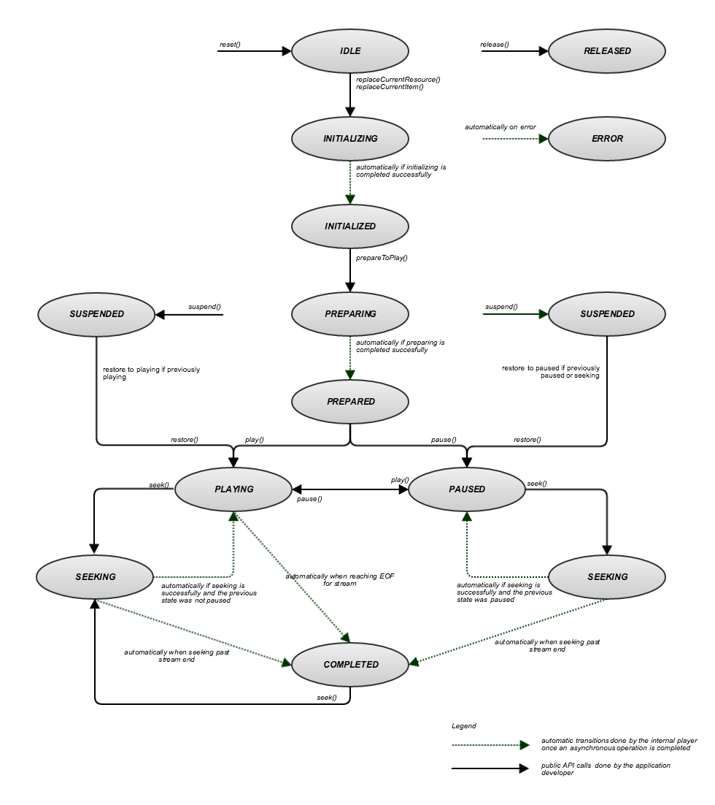

# MediaPlayer对象的生命周期和状态 {#lifecycle-and-statuses-of-the-mediaplayer-object}

媒体播放器的状态决定了哪些操作合法。

使用媒体播放器状态：

* 您可以检索 `MediaPlayer` 对象 `MediaPlayer.getStatus()`.

* 状态列表在 [MediaPlayerStatus](https://help.adobe.com/en_US/primetime/api/psdk/javadoc_2.7/com/adobe/mediacore/MediaPlayerStatus.html) 枚举。

生命周期的状态转换图 `MediaPlayer` 实例：
<!--<a id="fig_A6425F24C7734DC681D992859D2A6743"></a>-->



下表提供有关媒体播放器的生命周期和状态的详细信息：

<table id="table_82757A0043EB4AACA474E6B30326A6B7"> 
 <thead> 
  <tr> 
   <th colname="col1" class="entry"> 状态 </th> 
   <th colname="col2" class="entry"> 发生于 </th> 
  </tr> 
 </thead>
 <tbody> 
  <tr> 
   <td colname="col1"> 空闲 </td> 
   <td colname="col2"> <p>媒体播放器的初始状态。 播放器已创建，正在等待您指定媒体播放器项目。 </p> </td> 
  </tr> 
  <tr> 
   <td colname="col1"> 正在初始化 </td> 
   <td colname="col2"> <p>应用程序调用 <span class="codeph"> MediaPlayer.replaceCurrentItem() </span>. </p> <p>正在加载媒体播放器项目。 </p> </td> 
  </tr> 
  <tr> 
   <td colname="col1"> 已初始化 </td> 
   <td colname="col2"> <p>TVSDK已成功设置媒体播放器项目。 </p> </td> 
  </tr> 
  <tr> 
   <td colname="col1"> 正在准备 </td> 
   <td colname="col2"> <p>应用程序调用 <span class="codeph"> MediaPlayer.prepareToPlay() </span>. 媒体播放器正在加载媒体播放器项目和任何关联的资源。 </p> </td> 
  </tr> 
  <tr> 
   <td colname="col1"> 已准备 </td> 
   <td colname="col2"> <p>TVSDK已准备媒体流，并尝试执行广告解析和广告插入（如果已启用）。 内容已准备好，并且已在时间轴中插入广告，或者广告过程失败。 </p> <p>可以开始缓冲或播放。 </p> </td> 
  </tr> 
  <tr> 
   <td colname="col1"> 播放/暂停 </td> 
   <td colname="col2"> <p>当应用程序播放和暂停媒体时，媒体播放器会在这些状态之间移动。 </p> </td> 
  </tr> 
  <tr> 
   <td colname="col1"> 已暂停 </td> 
   <td colname="col2"> <p>如果应用程序在播放器播放或暂停时离开播放、关闭设备或切换应用程序，则媒体播放器将暂停并释放资源。 </p> <p>呼叫 <span class="codeph"> MediaPlayer.restore() </span> 将播放器返回到播放器被“挂起”之前的状态。 例外情况是，如果调用暂停时播放器正在搜寻，则播放器将暂停，然后是暂停。 </p> <p>重要提示：  <p>请记住以下信息： 
      <ul id="ul_1B21668994D1474AAA0BE839E0D69B00"> 
       <li id="li_08459A3AB03C45588D73FA162C27A56C">此 <span class="codeph"> MediaPlayer </span> 自动调用 <span class="codeph"> 暂停 </span> 仅当使用的曲面对象 <span class="codeph"> MediaPlayerView </span> 已被销毁。 </li> 
       <li id="li_B9926AA2E7B9441490F37D24AE2678A1">此 <span class="codeph"> MediaPlayer </span> 自动调用 <span class="codeph"> restore() </span> 仅当使用新曲面对象时 <span class="codeph"> MediaPlayerView </span> 创建。 </li> 
      </ul> </p> </p> <p>如果您始终希望在恢复MediaPlayer时暂停播放，请让应用程序调用 <span class="codeph"> MediaPlayer.pause() </span> 在Android活动的 <span class="codeph"> onPause() </span> 方法。 </p> </td> 
  </tr> 
  <tr> 
   <td colname="col1"> 完成 </td> 
   <td colname="col2"> <p>播放器已到达流结尾，并且播放已停止。 </p> </td> 
  </tr> 
  <tr> 
   <td colname="col1"> 已发布 </td> 
   <td colname="col2"> <p>您的应用程序已发布媒体播放器，该播放器还会发布任何关联的资源。 您无法再使用此实例。 </p> </td> 
  </tr> 
  <tr> 
   <td colname="col1"> 错误 </td> 
   <td colname="col2"> <p>处理过程中出错。 错误还可能会影响应用程序下一步可以执行的操作。 有关更多信息，请参阅 <a href="../../../tvsdk-2.7-for-android/content-playback-options/t-psdk-android-2.7-error-handling-set-up.md#set-up-error-handling" format="dita" scope="local"> 设置错误处理 </a>. </p> </td> 
  </tr> 
 </tbody> 
</table>

>[!TIP]
>
>您可以使用状态提供对进程的反馈，例如，在等待下一个状态更改时执行旋转操作，或在播放媒体时执行后续步骤，例如在调用下一个方法之前等待适当的状态。

例如：

```java
mediaPlayer.addEventListener(MediaPlayerEvent STATUS_CHANGED, new StatusChangeEventListener() { 
    @Override  
    public void onStatusChanged(MediaPlayerStatusChangeEvent event) { 
        switch(event.getStatus()) { 
            case INITIALIZED: 
                mediaPlayer.prepareToPlay(); 
                break; 
            case PREPARING: 
                showBufferingSpinner(); 
                break; 
            case PREPARED: 
                hideBufferingSpinner(); 
                mediaPlayer.play(); 
                break; 
            ...                
        } 
        ... 
    } 
}); 
```
