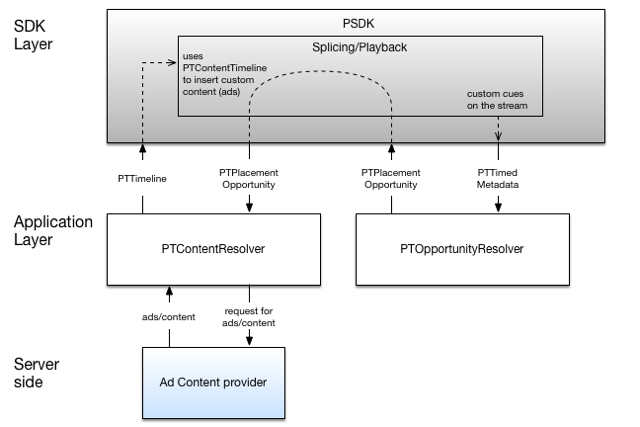

# 实施自定义机会/内容解析程序 {#implement-a-custom-opportunity-content-resolver}

您可以基于默认解析器实施解析器。

<!--<a id="fig_CC41E2A66BDB4115821F33737B46A09B"></a>-->



1. 通过扩展 `PTContentResolver` 抽象类。

   `PTContentResolver` 是一个必须由内容解析程序类实现的接口。 也可以使用具有相同名称的抽象类，并自动处理配置（获取委托）。

   >[!TIP]
   >
   >`PTContentResolver` 是通过 `PTDefaultMediaPlayerClientFactory` 类。 客户端可以通过扩展 `PTContentResolver` 抽象类。 默认情况下，除非特别删除， `PTDefaultAdContentResolver` 在中注册 `PTDefaultMediaPlayerClientFactory`.

   ```
   @protocol PTContentResolver <NSObject> 
   @required 
   + (BOOL)shouldHandleOpportunity:(PTPlacementOpportunity *)opportunity;  
   //Detector returns YES/NO if it should handle the following placement opportunity 
   - (void)configWithPlayerItem:(PTMediaPlayerItem *)item  
                 delegate:(id<PTContentResolverDelegate> delegate); 
   - (void)process:(PTPlacementOpportunity *)opportunity; 
   - (void)timeout:(PTPlacementOpportunity *)opportunity;  
   //The timeout method gets invoked if the TVSDK decides that the  
   //PTContentResolver is taking too much time to respond. 
   @end 
   
   @interface PTContentResolver : NSObject <PTContentResolver> 
   
   @property (readonly) id<PTContentResolverDelegate> delegate; 
   @property (readonly) PTMediaPlayerItem *playerItem; 
   
   - (BOOL)shouldHandleOpportunity:(PTPlacementOpportunity *)opportunity; 
   - (void)configWithPlayerItem:(PTMediaPlayerItem *)item  
                  delegate:(id<PTContentResolverDelegate>) delegate; 
   - (void)process:(NSArray *)opportunities; 
   - (void)cancel:(NSArray *)opportunities; 
   @end
   ```

1. 实施 `shouldResolveOpportunity` 并返回 `YES` 如果它应处理收到的 `PTPlacementOpportunity`.
1. 实施 `resolvePlacementOpportunity`，开始加载替代内容或广告。
1. 加载广告后，准备 `PTTimeline` 包含有关要插入的内容的信息。

       以下是关于时间线的有用信息：
   
   * 可以有多个 `PTAdBreak`前置、中置和后置类型的数量。

      * A `PTAdBreak` 具有以下属性：

         * A `CMTimeRange` 以及休息时间的开始时间和持续时间。

            这被设置为 `PTAdBreak`.

         * `NSArray` 之 `PTAd`s.

            将此项设置为的广告属性 `PTAdBreak`.
   * A `PTAd` 表示广告，并且每个 `PTAd` 具有以下属性：

      * A `PTAdHLSAsset` 设置为广告的主要资源属性。
      * 可能有多个 `PTAdAsset` 实例作为可点击广告或横幅广告。

   例如：

   ```
   NSMutableArray *ptBreaks = [[[NSMutableArray alloc] init] autorelease]; 
   
   // Prepare the primary asset of the ad - links to ad m3u8 
   PTAdHLSAsset *ptAdAsset = [[[PTAdHLSAsset alloc] init] autorelease]; 
   ptAdAsset.source = AD_SOURCE_M3U8; 
   ptAdAsset.id = FAKE_NUMBER_ID; 
   ptAdAsset.format = @"video"; 
   
   // Prepare the ad itself. 
   PTAd *ptAd = [[[PTAd alloc] init] autorelease]; 
   ptAd.primaryAsset = ptAdAsset; 
   ptAd.primaryAsset.ad = ptAd; 
   
   // Prepare the break and add the ad created above. 
   PTAdBreak *ptBreak = [[[PTAdBreak alloc] init] autorelease]; 
   ptBreak.relativeRange = CMTimeRangeMake(BREAK_START_TIME, BREAK_DURATION_VALUE); 
   [ptBreak addAd:ptAd]; 
   
   // Add the break to array of breaks. 
   [ptBreaks addObject:adBreak]; 
   
   // Once all breaks have been prepared, they can be set on timeline 
   PTTimeline *_timeline = [[PTTimeline alloc] init]; 
   _timeline.adBreaks = ptBreaks;
   ```

1. 调用 `didFinishResolvingPlacementOpportunity`，它提供 `PTTimeline`.
1. 通过调用，将自定义内容/广告解析器注册到默认的媒体播放器工厂 `registerContentResolver`.

   ```
   //Remove default content/ad resolver 
   [[PTDefaultMediaPlayerFactory defaultFactory] clearContentResolvers]; 
   
   //Create an instance of your content/ad resolver (id <PTContentResolver>) 
   CustomContentResolver *contentResolver = [[CustomContentResolver alloc] init]; 
   
   //Set custom content/ad resolver 
   [[PTDefaultMediaPlayerFactory defaultFactory] registerContentResolver:[contentResolver autorelease]];
   ```

1. 如果您实施了自定义机会解析器，请将其注册到默认的媒体播放器工厂。

   >[!TIP]
   >
   >您无需注册自定义机会解析程序即可注册自定义内容/广告解析程序。

   ```
   //Remove default opportunity resolver 
   [[PTDefaultMediaPlayerFactory defaultFactory] clearOpportunityResolvers]; 
   
   //Create an instance of your opportunity resolver (id <PTOpportunityResolver>) 
   CustomOpportunityResolver *opportunityResolver = [[CustomOpportunityResolver alloc] init]; 
   
   //Set custom opportunity resolver 
   [[PTDefaultMediaPlayerFactory defaultFactory]  
              registerOpportunityResolver:[opportunityResolver autorelease]];
   ```

当播放器加载内容并确定VOD或LIVE类型时，会发生以下情况之一：

* 如果内容为VOD，则使用自定义内容解析器获取整个视频的广告时间轴。
* 如果内容为“实时”内容，则每次在内容中检测到置入机会（提示点）时都会调用自定义内容解析器。
